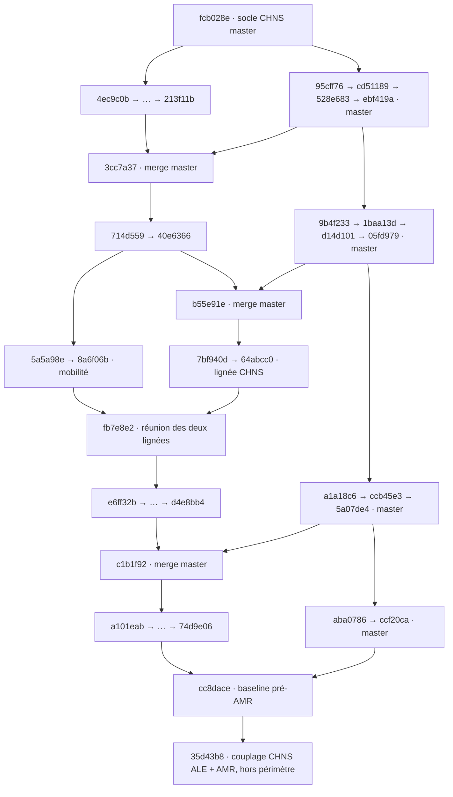

# Chronologie vérifiée de la branche CHNS avant l’ajout AMR

La référence étudiée est [cc8dace](https://github.com/arthurbawin/fez/commit/cc8dace141900b82e5790fa878e39d9c54898784), datée du 16 septembre 2026. Elle est le parent direct de [35d43b8](https://github.com/arthurbawin/fez/commit/35d43b8e3bc4cae33a6ed7b6b57a6f3d77e93858) (« Couple CHNS ALE with tree-based AMR », 18 septembre). La [comparaison avec master figé à ccf20ca](https://github.com/arthurbawin/fez/compare/ccf20caa0745cc2fe640f879d34acf2bf3855e6c...cc8dace141900b82e5790fa878e39d9c54898784) contient **61 commits propres à la branche, dont 5 fusions**. Les **13 commits de master** survenus depuis le point de départ sont listés séparément en annexe.

Le point de départ déductible du graphe est le parent du premier commit propre : [fcb028e](https://github.com/arthurbawin/fez/commit/fcb028e4c10c253a30c387b3665f9b38cde2bf3e) (« Incompressible CHNS assembler (#70) »). Ce commit fournit déjà les assembleurs CHNS communs, y compris le chemin ALE. Les emplacements SUPG/PSPG et le forçage de traceur dans l’élasticité ne sont pas encore tous implémentés. La relation parent prouve l’ascendance; elle ne donne pas à elle seule la date administrative de création d’un nom de branche.

## Lire correctement ce périmètre

- **Pré-AMR signifie avant le couplage spécialisé du 18 septembre.** L’AMR chaleur, puis l’AMR Navier–Stokes/CHNS générique, sont déjà importées de master dans cette baseline.
- **61 commits ne signifient pas 61 fonctionnalités indépendantes.** Le registre sépare création, raccord, correctif, test, refactorisation et fusion.
- **Les dates d’auteur ne constituent pas l’ordre historique.** Toutes les relations parent→enfant internes sont vérifiées. Par exemple, 558a30e porte une date d’auteur antérieure à son parent d66e22e, mais un horodatage de commit postérieur.
- **Le registre distingue état historique et état final.** Le modèle de mobilité 2 change deux fois; l’indépendance temporaire de la correction de profil vis-à-vis de M est annulée.
- **Preuve statique seulement.** Les sources sont exclusivement les métadonnées, patches et fichiers GitHub. Aucun build, test, commande Git de mutation ou calcul physique n’a été exécuté.

## Graphe des lignées et des fusions

Les flèches représentent les parents; les points de suspension condensent des chaînes détaillées ci-dessous. À une fusion, le premier parent décrit la ligne receveuse. La réunion fb7e8e2 a pour premier parent 8a6f06b (mobilité) et pour second parent 64abcc0 (ligne CHNS); il serait donc faux de raconter toute l’histoire comme une seule suite de commits datés.

| Fusion | Premier parent | Second parent | Ce qu’elle importe dans son premier parent |
|---|---|---|---|
| [3cc7a37](https://github.com/arthurbawin/fez/commit/3cc7a3772a24b77f9d1d87e0a46cfeb0d439ba98) | [213f11b](https://github.com/arthurbawin/fez/commit/213f11b9347d5c63d04de1097c8089f04fe3f338) | [ebf419a](https://github.com/arthurbawin/fez/commit/ebf419ac693f2027dc0e0a9546574ac7436b63f6) | [95cff76](https://github.com/arthurbawin/fez/commit/95cff76d6e20dcff1cce948ce1aa0c93fe05bab5), [cd51189](https://github.com/arthurbawin/fez/commit/cd51189769759453acef11946685db749443f09a), [528e683](https://github.com/arthurbawin/fez/commit/528e683ef7b6129c39a51ea8e96d7e57ea4f8b3e), [ebf419a](https://github.com/arthurbawin/fez/commit/ebf419ac693f2027dc0e0a9546574ac7436b63f6) |
| [b55e91e](https://github.com/arthurbawin/fez/commit/b55e91ed8b8148eafa90ab9d2cfc7fd820199924) | [40e6366](https://github.com/arthurbawin/fez/commit/40e636632aa8fff9e5960c230d67c6ade48b813b) | [05fd979](https://github.com/arthurbawin/fez/commit/05fd979b5950d54aa58195e62ff13e48e838e484) | [9b4f233](https://github.com/arthurbawin/fez/commit/9b4f2333ab6b806fe99758e44e5d0fc39876b998), [1baa13d](https://github.com/arthurbawin/fez/commit/1baa13ddf2f44c2b3986a80bad8f1ee21c9dc0be), [d14d101](https://github.com/arthurbawin/fez/commit/d14d1018a79c4873479dadf062c8177deb508fa3), [05fd979](https://github.com/arthurbawin/fez/commit/05fd979b5950d54aa58195e62ff13e48e838e484) |
| [fb7e8e2](https://github.com/arthurbawin/fez/commit/fb7e8e23edc3b4fe78514aab6f78ef1633c67e68) | [8a6f06b](https://github.com/arthurbawin/fez/commit/8a6f06b8b2bf36e4eec04c7fcca76eb826d507e1) | [64abcc0](https://github.com/arthurbawin/fez/commit/64abcc0bfee5947dc1ab95ad90d6a31a7cc2fe39) | [9b4f233](https://github.com/arthurbawin/fez/commit/9b4f2333ab6b806fe99758e44e5d0fc39876b998), [1baa13d](https://github.com/arthurbawin/fez/commit/1baa13ddf2f44c2b3986a80bad8f1ee21c9dc0be), [d14d101](https://github.com/arthurbawin/fez/commit/d14d1018a79c4873479dadf062c8177deb508fa3), [05fd979](https://github.com/arthurbawin/fez/commit/05fd979b5950d54aa58195e62ff13e48e838e484); commits de la branche : [b55e91e](https://github.com/arthurbawin/fez/commit/b55e91ed8b8148eafa90ab9d2cfc7fd820199924), [7bf940d](https://github.com/arthurbawin/fez/commit/7bf940d48ecc7952ff4b267c2a3896a62472d613), [64abcc0](https://github.com/arthurbawin/fez/commit/64abcc0bfee5947dc1ab95ad90d6a31a7cc2fe39) |
| [c1b1f92](https://github.com/arthurbawin/fez/commit/c1b1f921d7caec1aa904d355e17dd55fdeb644a7) | [d4e8bb4](https://github.com/arthurbawin/fez/commit/d4e8bb48bd99e944fd76d03f223f37b7946a5946) | [5a07de4](https://github.com/arthurbawin/fez/commit/5a07de463e1ead3ef028dd558d0b22a5441010b7) | [a1a18c6](https://github.com/arthurbawin/fez/commit/a1a18c67be82351c5ba612db448a821f70a76718), [ccb45e3](https://github.com/arthurbawin/fez/commit/ccb45e3e3b01cacf77a0091fa4ec1d53e5d38e0a), [5a07de4](https://github.com/arthurbawin/fez/commit/5a07de463e1ead3ef028dd558d0b22a5441010b7) |
| [cc8dace](https://github.com/arthurbawin/fez/commit/cc8dace141900b82e5790fa878e39d9c54898784) | [74d9e06](https://github.com/arthurbawin/fez/commit/74d9e06ed2fcff3d614600a8029d5b3642cf1156) | [ccf20ca](https://github.com/arthurbawin/fez/commit/ccf20caa0745cc2fe640f879d34acf2bf3855e6c) | [aba0786](https://github.com/arthurbawin/fez/commit/aba07862f2252ac2808e9333ec805cd59123cfd6), [ccf20ca](https://github.com/arthurbawin/fez/commit/ccf20caa0745cc2fe640f879d34acf2bf3855e6c) |

Les quatre commits master que fb7e8e2 apporte à sa ligne mobilité avaient déjà été intégrés à la ligne CHNS par b55e91e. L’annexe les compte une seule fois.

## Jalons

| Entrées | Construction | Résultat |
|---|---|---|
| 1–6 | Stabilisation fixe puis ALE | Le CHNS commun de master reçoit SUPG/PSPG, puis les dérivées géométriques nécessaires au maillage mobile. |
| 7–12 | Présolveur élastique et raccord au calcul | Renommage elasticity, forçage analytique puis FE, injection, cache et conditions de bord. |
| 13–19 | Construction progressive de la variante enlarged | Données psi → reconstruction de Helmholtz → solveur/exécutable → forçage → présolveur hybride. |
| 20–26 | Mouillage, robustesse, initialisation et diagnostic | Angle statique, signes du transport, empreinte du cache, CFL ALE, sorties et transmission de psi. |
| 27–34 | Mobilité dégénérée et trois choix CHNS | La mobilité est découplée du modèle CHNS; Ding–Horriche et Abels NLM arrivent avec tests distincts. |
| 35–43 | Imports master et bifurcation de la mobilité | Les parents montrent une branche parallèle au départ de 40e6366, réunie à la branche principale par fb7e8e2. |
| 44–54 | Mobilités adaptatives, qualité et exploitation | Extension ALE, variantes de mobilité, normalisation des lobes, diagnostics, reprise PVD, sondes et adaptation du temps. |
| 55–61 | Formules finales puis dernier merge pré-AMR | Modèle 2 restreint au cœur, correction de profil locale, puis import de l’AMR NS et des intégrales de champs. |

## Registre des 61 commits propres

Les dates ci-dessous sont celles de l’auteur, en UTC; le SHA fixe toujours le contenu. Les fichiers cités sont ceux examinés pour étayer le résumé, pas une déclaration de lecture de tous les fichiers touchés. L’inventaire intégral de la réponse API, statuts, anciennes destinations de renommage et compteurs se trouve dans [history-ledger.json](../../data/history-ledger.json).

### 01. Sélection de l’assembleur NS — [4ec9c0b](https://github.com/arthurbawin/fez/commit/4ec9c0b5709929f6bd23362f88268537fd659399)

**Correctif · 2026-06-23 20:18:42 UTC.** Parent : [fcb028e](https://github.com/arthurbawin/fez/commit/fcb028e4c10c253a30c387b3665f9b38cde2bf3e).

Titre Git : Fix NS assembler setup

Corrige la branche sans stabilisation de NSSolver::setup_assemblers : elle appelle explicitement setup_assemblers<dim, ScratchData, CopyData, ns_laplace_form>. Ce premier commit part directement du socle fcb028e.

**Fichiers de preuve :** [src/incompressible_ns_solver.cpp](https://github.com/arthurbawin/fez/blob/4ec9c0b5709929f6bd23362f88268537fd659399/src/incompressible_ns_solver.cpp).

**Couverture API :** 1 fichiers recensés; 1 patches présents.

**Portée/limite :** Ne crée pas le solveur NS ni le système CHNS.

### 02. Stabilisation CHNS sur maillage fixe — [3fc7512](https://github.com/arthurbawin/fez/commit/3fc75123bcac5bce6430b7bc865e534a472b63cc)

**Fonctionnalité · 2026-06-23 20:21:06 UTC.** Parent : [4ec9c0b](https://github.com/arthurbawin/fez/commit/4ec9c0b5709929f6bd23362f88268537fd659399).

Titre Git : Add CHNS stabilization

Active SUPG pour quantité de mouvement et traceur, PSPG pour pression, ainsi que leurs blocs de Jacobienne. Ajoute les Laplaciens du potentiel, les tau dans ScratchData, les couplages de pression et des tests Jacobienne/MMS. Une assertion refuse encore la stabilisation avec maillage mobile.

**Fichiers de preuve :** [src/assembly/incompressible_chns_assemblers.cpp](https://github.com/arthurbawin/fez/blob/3fc75123bcac5bce6430b7bc865e534a472b63cc/src/assembly/incompressible_chns_assemblers.cpp) ; [include/assembly/incompressible_chns_assemblers.h](https://github.com/arthurbawin/fez/blob/3fc75123bcac5bce6430b7bc865e534a472b63cc/include/assembly/incompressible_chns_assemblers.h) ; [include/scratch_data.h](https://github.com/arthurbawin/fez/blob/3fc75123bcac5bce6430b7bc865e534a472b63cc/include/scratch_data.h).

**Couverture API :** 10 fichiers recensés; 10 patches présents.

**Portée/limite :** La stabilisation ALE n’arrive qu’en 558a30e. Les fichiers .output sont des références versionnées, non des tests exécutés pour cet audit.

### 03. Portée du test de Jacobienne stabilisée — [eb54dfc](https://github.com/arthurbawin/fez/commit/eb54dfc529bf817301ec08ba592d96435fb3a544)

**Documentation · 2026-06-25 13:49:55 UTC.** Parent : [3fc7512](https://github.com/arthurbawin/fez/commit/3fc75123bcac5bce6430b7bc865e534a472b63cc).

Titre Git : Add just explicit comment about a stab test

Ajoute un commentaire au test à un pas : la Jacobienne fige les paramètres SUPG/PSPG et leur dérivée manque à la comparaison par différences finies hors du cas où elle s’annule. Renvoie au test MMS pour la robustesse sur plusieurs pas.

**Fichiers de preuve :** [tests/incompressible_chns/jacobian_matrix_stabilized.prm](https://github.com/arthurbawin/fez/blob/eb54dfc529bf817301ec08ba592d96435fb3a544/tests/incompressible_chns/jacobian_matrix_stabilized.prm).

**Couverture API :** 1 fichiers recensés; 1 patches présents.

**Portée/limite :** Aucun changement d’algorithme.

### 04. Révision de l’assemblage stabilisé — [238e0af](https://github.com/arthurbawin/fez/commit/238e0afeb84181c30be57484d5cc3a259782f56e)

**Refactorisation · 2026-06-25 20:58:40 UTC.** Parent : [eb54dfc](https://github.com/arthurbawin/fez/commit/eb54dfc529bf817301ec08ba592d96435fb3a544).

Titre Git : Try to stick to all comments !

Exprime le résidu fort de quantité de mouvement en unités de force, avec PSPG pondéré par 1/rho et sa variation; simplifie la configuration ScratchData et calcule les Laplaciens directement. Évite de calculer deux fois tau pour CHNS, contrôle rho>0, étend le test SUPG et renomme les tests MMS.

**Fichiers de preuve :** [src/assembly/incompressible_chns_assemblers.cpp](https://github.com/arthurbawin/fez/blob/238e0afeb84181c30be57484d5cc3a259782f56e/src/assembly/incompressible_chns_assemblers.cpp) ; [include/scratch_data.h](https://github.com/arthurbawin/fez/blob/238e0afeb84181c30be57484d5cc3a259782f56e/include/scratch_data.h) ; [src/scratch_data.cpp](https://github.com/arthurbawin/fez/blob/238e0afeb84181c30be57484d5cc3a259782f56e/src/scratch_data.cpp).

**Couverture API :** 11 fichiers recensés; 8 patches présents, 3 renommages sans changement de contenu.

**Portée/limite :** Certains fichiers de tests sont des renommages sans modification, donc sans patch; leurs métadonnées et ancien chemin sont conservés.

### 05. Ordre des blocs u–p–phi–mu — [d66e22e](https://github.com/arthurbawin/fez/commit/d66e22e3fa152ca584cab725e56e72e9027d999b)

**Refactorisation · 2026-06-25 21:42:17 UTC.** Parent : [238e0af](https://github.com/arthurbawin/fez/commit/238e0afeb84181c30be57484d5cc3a259782f56e).

Titre Git : Replace continuity bloc to match the natural ordering u-p-phi-mu and group some terms.

Replace les lignes de continuité/PSPG entre quantité de mouvement et traceur dans assemble_rhs. Factorise une partie de la variation du résidu de quantité de mouvement en phi.

**Fichiers de preuve :** [src/assembly/incompressible_chns_assemblers.cpp](https://github.com/arthurbawin/fez/blob/d66e22e3fa152ca584cab725e56e72e9027d999b/src/assembly/incompressible_chns_assemblers.cpp).

**Couverture API :** 1 fichiers recensés; 1 patches présents.

**Portée/limite :** Réorganisation de l’assemblage existant, pas ajout d’une nouvelle physique.

### 06. Stabilisation CHNS–ALE — [558a30e](https://github.com/arthurbawin/fez/commit/558a30efd84acd37148fa853d6fc0e533d7d7fb2)

**Extension · 2026-06-25 15:01:15 UTC.** Parent : [d66e22e](https://github.com/arthurbawin/fez/commit/d66e22e3fa152ca584cab725e56e72e9027d999b).

Titre Git : Add CHNS Ale stab with one mms to test the imnplementation and one unit test to test the deal.ii implementation of the function MappingFEField<dim, spacedim, VectorType>::transform in mapping_fe_field.templates.h

Retire l’interdiction ALE et assemble les variations en position x des résidus SUPG/PSPG : vitesse relative, gradients, Hessiennes et poids d’intégration. Ajoute les données de Hessiennes nécessaires, un MMS espace-temps stabilisé ALE et le test unitaire ale_hessian.

**Fichiers de preuve :** [src/assembly/incompressible_chns_assemblers.cpp](https://github.com/arthurbawin/fez/blob/558a30efd84acd37148fa853d6fc0e533d7d7fb2/src/assembly/incompressible_chns_assemblers.cpp) ; [include/scratch_data.h](https://github.com/arthurbawin/fez/blob/558a30efd84acd37148fa853d6fc0e533d7d7fb2/include/scratch_data.h) ; [tests/unit_tests/ale_hessian.cc](https://github.com/arthurbawin/fez/blob/558a30efd84acd37148fa853d6fc0e533d7d7fb2/tests/unit_tests/ale_hessian.cc).

**Couverture API :** 9 fichiers recensés; 9 patches présents.

**Portée/limite :** La Jacobienne conserve tau figé. La date d’auteur précède celle de son parent : l’ordre vient de la relation parent, pas du tri des dates.

### 07. Renommage elasticity — [5e675bc](https://github.com/arthurbawin/fez/commit/5e675bc43b5a3a24c2749503b78d4e9aec5bb97e)

**Refactorisation · 2026-06-25 15:41:36 UTC.** Parent : [558a30e](https://github.com/arthurbawin/fez/commit/558a30efd84acd37148fa853d6fc0e533d7d7fb2).

Titre Git : Rename linear_elasticity solver to elasticity. The pseudo-solid/elasticity solver now supports neo-hookean and ogden constitutive models, so linear no longer describes it. Rename the solver, its files, parameters and the dedicated test directory. The linear elasticity constitutive model keeps its name.

Renomme LinearElasticitySolver, fichiers, exécutable, type de solveur, sources et sous-section Linear elasticity en Elasticity; déplace le répertoire de tests. La loi constitutive linear elasticity conserve son nom; les lois neo-hookean et ogden ne sont pas créées par ce renommage.

**Fichiers de preuve :** [include/elasticity_solver.h](https://github.com/arthurbawin/fez/blob/5e675bc43b5a3a24c2749503b78d4e9aec5bb97e/include/elasticity_solver.h) ; [src/elasticity_solver.cpp](https://github.com/arthurbawin/fez/blob/5e675bc43b5a3a24c2749503b78d4e9aec5bb97e/src/elasticity_solver.cpp) ; [src/parameters.cpp](https://github.com/arthurbawin/fez/blob/5e675bc43b5a3a24c2749503b78d4e9aec5bb97e/src/parameters.cpp).

**Couverture API :** 29 fichiers recensés; 21 patches présents, 8 renommages sans changement de contenu.

**Portée/limite :** Des sorties de tests sont déplacées à l’identique; absence de patch normale pour ces renommages.

### 08. Présolveur élastique et forçage analytique CHNS — [893d6ad](https://github.com/arthurbawin/fez/commit/893d6ad19884ae3a503c3b76a7815a38e7ffa779)

**Fonctionnalité · 2026-06-27 16:21:29 UTC.** Parent : [5e675bc](https://github.com/arthurbawin/fez/commit/5e675bc43b5a3a24c2749503b78d4e9aec5bb97e).

Titre Git : Add CHNS moving-mesh forcing to the elasticity presolver (function mode)

Implémente le forçage de compression CHNS dans l’assembleur élastique en mode fonction : phi initial analytique est évalué sur la configuration déformée, avec gradient/Hessienne pour la Jacobienne. Ajoute un facteur régularisé, le choix off/chns form/custom, les paramètres de continuation du présolveur et un test de Jacobienne.

**Fichiers de preuve :** [src/assembly/elasticity_assemblers.cpp](https://github.com/arthurbawin/fez/blob/893d6ad19884ae3a503c3b76a7815a38e7ffa779/src/assembly/elasticity_assemblers.cpp) ; [include/assembly/elasticity_assemblers.h](https://github.com/arthurbawin/fez/blob/893d6ad19884ae3a503c3b76a7815a38e7ffa779/include/assembly/elasticity_assemblers.h) ; [include/scratch_data_elasticity.h](https://github.com/arthurbawin/fez/blob/893d6ad19884ae3a503c3b76a7815a38e7ffa779/include/scratch_data_elasticity.h).

**Couverture API :** 10 fichiers recensés; 10 patches présents.

**Portée/limite :** À ce stade le mode champ du solveur complet reste non implémenté. La valeur custom est déclarée, sans fournir à elle seule un forçage fonctionnel.

### 09. Transmission de la position présolue à CHNS–ALE — [6a667e8](https://github.com/arthurbawin/fez/commit/6a667e8e3702bb3c3acfdadae9522310ec609dbc)

**Fonctionnalité · 2026-06-27 16:21:47 UTC.** Parent : [893d6ad](https://github.com/arthurbawin/fez/commit/893d6ad19884ae3a503c3b76a7815a38e7ffa779).

Titre Git : Inject the elasticity presolver mesh position into the CHNS-ALE solver

Ajoute create_elasticity_presolver, son appel dans le point d’entrée CHNS–ALE, une extraction de sous-solution par correspondance de composantes et NavierStokesSolver::attach_presolver. Le solveur initialise sa position de maillage à partir du champ du présolveur; ajoute un cas presolver_injection en 1/6 processus.

**Fichiers de preuve :** [include/presolver_tools.h](https://github.com/arthurbawin/fez/blob/6a667e8e3702bb3c3acfdadae9522310ec609dbc/include/presolver_tools.h) ; [src/navier_stokes_solver.cpp](https://github.com/arthurbawin/fez/blob/6a667e8e3702bb3c3acfdadae9522310ec609dbc/src/navier_stokes_solver.cpp) ; [solvers/incompressible_chns_ale.cpp](https://github.com/arthurbawin/fez/blob/6a667e8e3702bb3c3acfdadae9522310ec609dbc/solvers/incompressible_chns_ale.cpp).

**Couverture API :** 8 fichiers recensés; 8 patches présents.

**Portée/limite :** Transmet ici la position; psi n’existe pas encore dans cette séquence.

### 10. Forçage CHNS en mode champ — [329547d](https://github.com/arthurbawin/fez/commit/329547dd06facc6fba5276c40ea1c862089343ed)

**Extension · 2026-06-27 16:52:48 UTC.** Parent : [6a667e8](https://github.com/arthurbawin/fez/commit/6a667e8e3702bb3c3acfdadae9522310ec609dbc).

Titre Git : Add field-mode CHNS moving-mesh forcing to the CHNS-ALE solver

Étend SourceFromCHNSTracerAssembler au ScratchData CHNS–ALE. Compression et transport dépendent du champ FE phi et de son gradient sur maillage mobile; la Jacobienne contient les variations en phi, position et vitesse. Met à jour les références d’injection.

**Fichiers de preuve :** [src/assembly/elasticity_assemblers.cpp](https://github.com/arthurbawin/fez/blob/329547dd06facc6fba5276c40ea1c862089343ed/src/assembly/elasticity_assemblers.cpp) ; [include/assembly/elasticity_assemblers.h](https://github.com/arthurbawin/fez/blob/329547dd06facc6fba5276c40ea1c862089343ed/include/assembly/elasticity_assemblers.h).

**Couverture API :** 4 fichiers recensés; 4 patches présents.

**Portée/limite :** Le signe du terme de transport sera corrigé par d9ec2c0.

### 11. Cache du maillage présolu — [f10512f](https://github.com/arthurbawin/fez/commit/f10512f8714466e51ae5acd5b4cca1c42f022a6c)

**Fonctionnalité · 2026-06-27 20:57:07 UTC.** Parent : [329547d](https://github.com/arthurbawin/fez/commit/329547dd06facc6fba5276c40ea1c862089343ed).

Titre Git : Add a partition-independent disk cache for the presolved mesh position

Ajoute lecture/écriture du champ présolu avec clés coordonnées de point de support/composante et empreinte des paramètres. Les modes réellement déclarés sont off, reuse et force_recompute; reuse essaie le cache puis recalcule en cas d’échec. Le commentaire d’assembleur précise que custom n’assemble pas encore de forçage.

**Fichiers de preuve :** [src/elasticity_solver.cpp](https://github.com/arthurbawin/fez/blob/f10512f8714466e51ae5acd5b4cca1c42f022a6c/src/elasticity_solver.cpp) ; [include/presolver_tools.h](https://github.com/arthurbawin/fez/blob/f10512f8714466e51ae5acd5b4cca1c42f022a6c/include/presolver_tools.h) ; [src/parameters.cpp](https://github.com/arthurbawin/fez/blob/f10512f8714466e51ae5acd5b4cca1c42f022a6c/src/parameters.cpp).

**Couverture API :** 6 fichiers recensés; 6 patches présents.

**Portée/limite :** Le commentaire d’une méthode mentionne read_only, mais ce mode n’apparaît pas dans l’énumération/parser de ce commit. L’empreinte est enrichie ensuite pour psi.

### 12. Contraintes de bord par identifiant et masques — [bae3e21](https://github.com/arthurbawin/fez/commit/bae3e218c03eb30a34ce2c755e831d51d659b742)

**Correctif · 2026-06-28 02:18:46 UTC.** Parent : [f10512f](https://github.com/arthurbawin/fez/commit/f10512f8714466e51ae5acd5b4cca1c42f022a6c).

Titre Git : Apply slip/flux boundary conditions one boundary id at a time, add per-component velocity and mesh-position masks

Applique séparément les contraintes de flux normal/tangentiel aux différents boundary_id, au lieu de regrouper les parois; ajoute constrain_u/v/w et les masques x/y/z pour ne fixer que certaines composantes. Les références cylinder_3d FSI et FSI monolithique sont modifiées.

**Fichiers de preuve :** [src/boundary_conditions.cpp](https://github.com/arthurbawin/fez/blob/bae3e218c03eb30a34ce2c755e831d51d659b742/src/boundary_conditions.cpp) ; [include/boundary_conditions.h](https://github.com/arthurbawin/fez/blob/bae3e218c03eb30a34ce2c755e831d51d659b742/include/boundary_conditions.h).

**Couverture API :** 8 fichiers recensés; 8 patches présents.

**Portée/limite :** Changement commun aux solveurs concernés, pas propre au seul CHNS.

### 13. Déclaration de psi et paramètres enlarged — [d0090cc](https://github.com/arthurbawin/fez/commit/d0090cc234fa78b0b720c2cd9c62ad9b4b45a178)

**Socle de fonctionnalité · 2026-06-29 14:36:10 UTC.** Parent : [bae3e21](https://github.com/arthurbawin/fez/commit/bae3e218c03eb30a34ce2c755e831d51d659b742).

Titre Git : Add enlarged (psi) tracer component ordering and parameters

Ajoute phase_enlarged, les indices/extracteurs logiques psi et le paramètre de template with_enlarged. Psi est ajouté après mu; les paramètres de largeur, correction mu, compression élargie et exposant sont déclarés et lus.

**Fichiers de preuve :** [include/components_ordering.h](https://github.com/arthurbawin/fez/blob/d0090cc234fa78b0b720c2cd9c62ad9b4b45a178/include/components_ordering.h) ; [include/solver_info.h](https://github.com/arthurbawin/fez/blob/d0090cc234fa78b0b720c2cd9c62ad9b4b45a178/include/solver_info.h) ; [src/parameters.cpp](https://github.com/arthurbawin/fez/blob/d0090cc234fa78b0b720c2cd9c62ad9b4b45a178/src/parameters.cpp).

**Couverture API :** 4 fichiers recensés; 4 patches présents.

**Portée/limite :** C’est le socle de données; aucune équation psi n’est assemblée à ce commit.

### 14. Données de quadrature psi — [7f22894](https://github.com/arthurbawin/fez/commit/7f22894320925b90b8220506ca917f5e900a7f3f)

**Socle de fonctionnalité · 2026-06-29 14:46:36 UTC.** Parent : [d0090cc](https://github.com/arthurbawin/fez/commit/d0090cc234fa78b0b720c2cd9c62ad9b4b45a178).

Titre Git : Add enlarged (psi) tracer data to the CHNS scratch data

Ajoute le drapeau enlarged et ScratchDataCHNS<dim,with_moving_mesh,with_enlarged>. Alloue et remplit les valeurs, gradients, fonctions de forme et source MMS de psi sur le maillage mobile.

**Fichiers de preuve :** [include/scratch_data.h](https://github.com/arthurbawin/fez/blob/7f22894320925b90b8220506ca917f5e900a7f3f/include/scratch_data.h) ; [src/scratch_data.cpp](https://github.com/arthurbawin/fez/blob/7f22894320925b90b8220506ca917f5e900a7f3f/src/scratch_data.cpp).

**Couverture API :** 2 fichiers recensés; 2 patches présents.

**Portée/limite :** Support ScratchData seulement; la reconstruction vient au commit suivant.

### 15. Reconstruction de Helmholtz de psi — [157c441](https://github.com/arthurbawin/fez/commit/157c4412a7a7d2c66e3f62aede5d4fe544ac9f98)

**Fonctionnalité · 2026-06-29 15:04:42 UTC.** Parent : [7f22894](https://github.com/arthurbawin/fez/commit/7f22894320925b90b8220506ca917f5e900a7f3f).

Titre Git : Assemble the enlarged (psi) tracer Helmholtz reconstruction in the CHNS assembler

Introduit la reconstruction de base psi − L²Δpsi = phi, sans source MMS ni correction optionnelle en mu, avec L = facteur_de_largeur × epsilon. Ajoute ses résidu/Jacobienne, y compris le couplage géométrique ALE; VolumeAssembler appelle les fonctions dédiées si with_enlarged.

**Fichiers de preuve :** [include/assembly/incompressible_chns_assemblers.h](https://github.com/arthurbawin/fez/blob/157c4412a7a7d2c66e3f62aede5d4fe544ac9f98/include/assembly/incompressible_chns_assemblers.h) ; [src/assembly/incompressible_chns_assemblers.cpp](https://github.com/arthurbawin/fez/blob/157c4412a7a7d2c66e3f62aede5d4fe544ac9f98/src/assembly/incompressible_chns_assemblers.cpp) ; [src/scratch_data.cpp](https://github.com/arthurbawin/fez/blob/157c4412a7a7d2c66e3f62aede5d4fe544ac9f98/src/scratch_data.cpp).

**Couverture API :** 5 fichiers recensés; 5 patches présents.

**Portée/limite :** Le marqueur psi est reconstruit, sans équation d’évolution temporelle propre. Pour l’option mu, le commentaire annonce phi − correction_mu, mais le code assemble le terme de résidu psi − phi + source_psi − correction_mu, avec le terme de gradient positif. Sans source MMS, le code correspond donc à psi − L²Δpsi = phi + correction_mu; le bloc de Jacobienne en mu confirme ce signe. La description suit ici le code et signale explicitement la divergence avec son commentaire.

### 16. Intégration de psi au solveur CHNS — [af95a45](https://github.com/arthurbawin/fez/commit/af95a456a99fcf43ad849bdd6a094e4d3bc8254f)

**Extension · 2026-06-29 15:29:20 UTC.** Parent : [157c441](https://github.com/arthurbawin/fez/commit/157c4412a7a7d2c66e3f62aede5d4fe544ac9f98).

Titre Git : Thread the enlarged (psi) tracer through the CHNS solver

Étend CHNSSolver au troisième paramètre with_enlarged et impose que cette variante soit ALE. Ajoute le champ au FESystem, masques, sparsité, erreurs, sources et solution manufacturée; instancie les variantes 2D/3D élargies.

**Fichiers de preuve :** [include/incompressible_chns_solver.h](https://github.com/arthurbawin/fez/blob/af95a456a99fcf43ad849bdd6a094e4d3bc8254f/include/incompressible_chns_solver.h) ; [src/incompressible_chns_solver.cpp](https://github.com/arthurbawin/fez/blob/af95a456a99fcf43ad849bdd6a094e4d3bc8254f/src/incompressible_chns_solver.cpp) ; [src/manufactured_solution.cpp](https://github.com/arthurbawin/fez/blob/af95a456a99fcf43ad849bdd6a094e4d3bc8254f/src/manufactured_solution.cpp).

**Couverture API :** 5 fichiers recensés; 5 patches présents.

**Portée/limite :** Le point d’entrée exécutable dédié est ajouté au commit suivant.

### 17. Point d’entrée CHNS–ALE enlarged — [f2b4351](https://github.com/arthurbawin/fez/commit/f2b43516860dbec3f08111784c6e2f904d868b6e)

**Fonctionnalité · 2026-06-29 15:52:11 UTC.** Parent : [af95a45](https://github.com/arthurbawin/fez/commit/af95a456a99fcf43ad849bdd6a094e4d3bc8254f).

Titre Git : Add the enlarged (psi) CHNS-ALE solver entry point and MMS test

Crée incompressible_chns_ale_enlarged et son test MMS espace-temps 1/6 processus. Impose psi sur les bords dirichlet_mms, uniformise le nom de champ psi et place le calcul de L après l’initialisation d’epsilon.

**Fichiers de preuve :** [solvers/incompressible_chns_ale_enlarged.cpp](https://github.com/arthurbawin/fez/blob/f2b43516860dbec3f08111784c6e2f904d868b6e/solvers/incompressible_chns_ale_enlarged.cpp) ; [src/incompressible_chns_solver.cpp](https://github.com/arthurbawin/fez/blob/f2b43516860dbec3f08111784c6e2f904d868b6e/src/incompressible_chns_solver.cpp) ; [tests/incompressible_chns_ale_enlarged/mms_chns_ale_enlarged_2d_spacetime.prm](https://github.com/arthurbawin/fez/blob/f2b43516860dbec3f08111784c6e2f904d868b6e/tests/incompressible_chns_ale_enlarged/mms_chns_ale_enlarged_2d_spacetime.prm).

**Couverture API :** 9 fichiers recensés; 9 patches présents.

**Portée/limite :** Présence du cas test constatée; aucune compilation/exécution dans cet audit.

### 18. Forçage de maillage piloté par psi — [8a59267](https://github.com/arthurbawin/fez/commit/8a5926785bb87f770b9b641d5b1fc6c58e36e253)

**Extension · 2026-06-29 19:34:51 UTC.** Parent : [f2b4351](https://github.com/arthurbawin/fez/commit/f2b43516860dbec3f08111784c6e2f904d868b6e).

Titre Git : Drive the moving-mesh forcing with the enlarged psi marker

Ajoute la transformation impaire lissée sign(psi)|psi|^q et le forçage élargi basé sur psi, tout en conservant la compression physique basée sur phi. Le transport utilise psi dans la variante enlarged; ajoute le bloc x←psi, l’enregistrement de l’assembleur et un test Jacobienne.

**Fichiers de preuve :** [include/assembly/elasticity_assemblers.h](https://github.com/arthurbawin/fez/blob/8a5926785bb87f770b9b641d5b1fc6c58e36e253/include/assembly/elasticity_assemblers.h) ; [src/assembly/elasticity_assemblers.cpp](https://github.com/arthurbawin/fez/blob/8a5926785bb87f770b9b641d5b1fc6c58e36e253/src/assembly/elasticity_assemblers.cpp) ; [src/incompressible_chns_solver.cpp](https://github.com/arthurbawin/fez/blob/8a5926785bb87f770b9b641d5b1fc6c58e36e253/src/incompressible_chns_solver.cpp).

**Couverture API :** 5 fichiers recensés; 5 patches présents.

**Portée/limite :** L’amplitude des lobes sera normalisée plus tard par d861c62.

### 19. Psi dans le présolveur élastique — [eb3f016](https://github.com/arthurbawin/fez/commit/eb3f01616eb65c01ab6677f2900a0100c518c6a9)

**Extension · 2026-06-29 20:44:00 UTC.** Parent : [8a59267](https://github.com/arthurbawin/fez/commit/8a5926785bb87f770b9b641d5b1fc6c58e36e253).

Titre Git : Reconstruct the enlarged marker psi in the elasticity presolver

Ajoute au présolveur un mode hybride : phi reste une fonction analytique, tandis que position et psi sont inconnues FE. PresolverPsiAssembler reconstruit psi et linéarise la variation de la source analytique avec la position; la compression élargie est active, le transport reste absent. Ajoute un test couvrant présolveur et CHNS aval.

**Fichiers de preuve :** [include/assembly/elasticity_assemblers.h](https://github.com/arthurbawin/fez/blob/eb3f01616eb65c01ab6677f2900a0100c518c6a9/include/assembly/elasticity_assemblers.h) ; [src/assembly/elasticity_assemblers.cpp](https://github.com/arthurbawin/fez/blob/eb3f01616eb65c01ab6677f2900a0100c518c6a9/src/assembly/elasticity_assemblers.cpp) ; [src/elasticity_solver.cpp](https://github.com/arthurbawin/fez/blob/eb3f01616eb65c01ab6677f2900a0100c518c6a9/src/elasticity_solver.cpp).

**Couverture API :** 11 fichiers recensés; 11 patches présents.

**Portée/limite :** Seule la position est transmise à ce stade; 7ae5094 ajoutera la transmission de psi. Ne pas reprendre les anciens commentaires comme description de la baseline finale.

### 20. Angle de contact statique — [fb26491](https://github.com/arthurbawin/fez/commit/fb26491a6b2764a9f2b1fb055c51f84e51384882)

**Fonctionnalité · 2026-06-30 16:22:53 UTC.** Parent : [eb3f016](https://github.com/arthurbawin/fez/commit/eb3f01616eb65c01ab6677f2900a0100c518c6a9).

Titre Git : Add the static contact-angle (wetting) Cahn-Hilliard boundary condition

Déclare contact angle en degrés puis stocke sa valeur en radians. ContactAngleBoundaryAssembler ajoute aux lignes du potentiel le terme de mouillage n·grad(phi)=−cos(theta)(1−phi²)/(sqrt(2)epsilon) et sa dérivée; ajoute les données de face et un test Jacobienne.

**Fichiers de preuve :** [src/boundary_conditions.cpp](https://github.com/arthurbawin/fez/blob/fb26491a6b2764a9f2b1fb055c51f84e51384882/src/boundary_conditions.cpp) ; [src/assembly/incompressible_chns_assemblers.cpp](https://github.com/arthurbawin/fez/blob/fb26491a6b2764a9f2b1fb055c51f84e51384882/src/assembly/incompressible_chns_assemblers.cpp) ; [include/cahn_hilliard.h](https://github.com/arthurbawin/fez/blob/fb26491a6b2764a9f2b1fb055c51f84e51384882/include/cahn_hilliard.h).

**Couverture API :** 10 fichiers recensés; 10 patches présents.

**Portée/limite :** Angle mesuré dans la phase phi=+1; valeur négative désactive le terme. Il s’agit d’un angle statique.

### 21. Signe du transport de maillage — [d9ec2c0](https://github.com/arthurbawin/fez/commit/d9ec2c0a1d4758518b8e5ee00de5fc4cb67c5627)

**Correctif · 2026-06-30 16:23:40 UTC.** Parent : [fb26491](https://github.com/arthurbawin/fez/commit/fb26491a6b2764a9f2b1fb055c51f84e51384882).

Titre Git : Restore the moving-mesh transport sign and document the forcing signs

Inverse le facteur de transport lu par les deux assemblages du forçage (résidu/Jacobienne), en conservant rhs -= forcing. Documente qu’un facteur de compression positif comprime vers l’interface et met à jour la référence Jacobienne enlarged.

**Fichiers de preuve :** [src/assembly/elasticity_assemblers.cpp](https://github.com/arthurbawin/fez/blob/d9ec2c0a1d4758518b8e5ee00de5fc4cb67c5627/src/assembly/elasticity_assemblers.cpp) ; [src/parameters.cpp](https://github.com/arthurbawin/fez/blob/d9ec2c0a1d4758518b8e5ee00de5fc4cb67c5627/src/parameters.cpp).

**Couverture API :** 4 fichiers recensés; 4 patches présents.

**Portée/limite :** Correctif de convention de signe, à appliquer à toute lecture d’un commit antérieur.

### 22. Empreinte du cache enlarged — [a10d236](https://github.com/arthurbawin/fez/commit/a10d2366d98dd74562767ca92b14e617caf98795)

**Correctif · 2026-06-30 16:24:08 UTC.** Parent : [d9ec2c0](https://github.com/arthurbawin/fez/commit/d9ec2c0a1d4758518b8e5ee00de5fc4cb67c5627).

Titre Git : Fix the presolved-mesh cache fingerprint for the enlarged forcing

Ajoute au fingerprint epsilon, type de forçage, activation enlarged, largeur psi, compression élargie et exposant. Enlève le transport de l’empreinte, puisqu’il ne participe pas au présolveur.

**Fichiers de preuve :** [src/elasticity_solver.cpp](https://github.com/arthurbawin/fez/blob/a10d2366d98dd74562767ca92b14e617caf98795/src/elasticity_solver.cpp).

**Couverture API :** 1 fichiers recensés; 1 patches présents.

**Portée/limite :** Évite le réemploi d’un cache calculé avec d’autres paramètres enlarged; ne modifie pas l’équation de reconstruction.

### 23. CFL sur configuration ALE — [e66c56b](https://github.com/arthurbawin/fez/commit/e66c56b4f99b1e8d266395f2a5df2e90c4091711)

**Correctif · 2026-06-30 16:24:35 UTC.** Parent : [a10d236](https://github.com/arthurbawin/fez/commit/a10d2366d98dd74562767ca92b14e617caf98795).

Titre Git : Use the deformed cell size and convective velocity for the ALE CFL

Étend compute_max_cfl avec positions précédentes, coefficients BDF et extracteur de position. Pour ALE, utilise la vitesse convective u−w et une longueur caractéristique issue du mapping déformé; le calcul fixe conserve son chemin.

**Fichiers de preuve :** [include/post_processing_tools.h](https://github.com/arthurbawin/fez/blob/e66c56b4f99b1e8d266395f2a5df2e90c4091711/include/post_processing_tools.h) ; [src/navier_stokes_solver.cpp](https://github.com/arthurbawin/fez/blob/e66c56b4f99b1e8d266395f2a5df2e90c4091711/src/navier_stokes_solver.cpp).

**Couverture API :** 2 fichiers recensés; 2 patches présents.

**Portée/limite :** Cette correction influe aussi sur les pas de temps FSI et leurs références.

### 24. Densité, pression Abels et échelles de temps — [7804d3c](https://github.com/arthurbawin/fez/commit/7804d3cc1b2f0532ff3f7577b7273a8c0429b28a)

**Fonctionnalité · 2026-07-02 14:03:44 UTC.** Parent : [e66c56b](https://github.com/arthurbawin/fez/commit/e66c56b4f99b1e8d266395f2a5df2e90c4091711).

Titre Git : Add CHNS Abels-pressure output and characteristic-time-scales CSV

Ajoute un champ nodal continu auxiliaire pour density et pressure_abels=p+phi*mu, et une table CSV d’échelles caractéristiques/dimensionnelles du système CHNS. Introduit les points d’extension de post-traitement et la sous-section time scales.

**Fichiers de preuve :** [src/incompressible_chns_solver.cpp](https://github.com/arthurbawin/fez/blob/7804d3cc1b2f0532ff3f7577b7273a8c0429b28a/src/incompressible_chns_solver.cpp) ; [include/post_processing_tools.h](https://github.com/arthurbawin/fez/blob/7804d3cc1b2f0532ff3f7577b7273a8c0429b28a/include/post_processing_tools.h) ; [src/parameters.cpp](https://github.com/arthurbawin/fez/blob/7804d3cc1b2f0532ff3f7577b7273a8c0429b28a/src/parameters.cpp).

**Couverture API :** 7 fichiers recensés; 7 patches présents.

**Portée/limite :** L’infrastructure de post-traitement sera remaniée lors des merges master; les noms de pression deviennent dépendants du modèle.

### 25. Recherche linéaire Newton et valeurs non finies — [7f8cb22](https://github.com/arthurbawin/fez/commit/7f8cb22d4b3d97020161952feaff3b76c2a20b7e)

**Correctif · 2026-07-02 14:04:20 UTC.** Parent : [7804d3c](https://github.com/arthurbawin/fez/commit/7804d3cc1b2f0532ff3f7577b7273a8c0429b28a).

Titre Git : Reject non-finite steps in the Newton line search

Initialise last_residual, mémorise le meilleur résidu fini et son alpha durant la recherche linéaire, puis utilise cette meilleure valeur en recours. Le code gère explicitement le cas où aucune valeur finie n’est trouvée.

**Fichiers de preuve :** [include/newton_solver.h](https://github.com/arthurbawin/fez/blob/7f8cb22d4b3d97020161952feaff3b76c2a20b7e/include/newton_solver.h).

**Couverture API :** 1 fichiers recensés; 1 patches présents.

**Portée/limite :** Robustesse numérique constatée dans le code; aucun résultat de simulation indépendant n’est revendiqué.

### 26. Transmission de psi comme estimation initiale — [7ae5094](https://github.com/arthurbawin/fez/commit/7ae5094cf2a23005f89af4788bdf4d330ddeeab9)

**Correctif · 2026-07-02 14:04:54 UTC.** Parent : [7f8cb22](https://github.com/arthurbawin/fez/commit/7f8cb22d4b3d97020161952feaff3b76c2a20b7e).

Titre Git : Inject the presolver's psi as the CHNS initial guess

À la transmission présolveur→CHNS, détecte la composante scalaire supplémentaire du présolveur et phase_enlarged du solveur destinataire, puis ajoute component_map[dim]=ordering->psi_lower. L’estimation initiale reçoit désormais position et psi.

**Fichiers de preuve :** [src/navier_stokes_solver.cpp](https://github.com/arthurbawin/fez/blob/7ae5094cf2a23005f89af4788bdf4d330ddeeab9/src/navier_stokes_solver.cpp).

**Couverture API :** 1 fichiers recensés; 1 patches présents.

**Portée/limite :** Modifie le comportement de eb3f016; les commentaires historiques affirmant que psi n’est jamais transmis sont dépassés.

### 27. Mobilité dégénérée et dérivées — [b5cf71d](https://github.com/arthurbawin/fez/commit/b5cf71ddebbed225631a071ed6c24758ea430dfd)

**Fonctionnalité · 2026-07-02 15:23:41 UTC.** Parent : [7ae5094](https://github.com/arthurbawin/fez/commit/7ae5094cf2a23005f89af4788bdf4d330ddeeab9).

Titre Git : Add the degenerate Cahn-Hilliard mobility model

Déclare une mobilité scalaire fonction de phi, avec expression analysée symboliquement, valeur, première et seconde dérivées et limiteur optionnel. Ajoute le modèle degenerate au parser et corrige le test erroné de la chaîne linear pour la mobilité constante.

**Fichiers de preuve :** [include/cahn_hilliard.h](https://github.com/arthurbawin/fez/blob/b5cf71ddebbed225631a071ed6c24758ea430dfd/include/cahn_hilliard.h) ; [src/parameters.cpp](https://github.com/arthurbawin/fez/blob/b5cf71ddebbed225631a071ed6c24758ea430dfd/src/parameters.cpp).

**Couverture API :** 3 fichiers recensés; 3 patches présents.

**Portée/limite :** Le branchement dans l’assemblage arrive dans 6c555a0. L’amplitude de la mobilité dégénérée appartient à son expression.

### 28. Assemblage à mobilité variable — [6c555a0](https://github.com/arthurbawin/fez/commit/6c555a0ccc1a7721a0206134674391612a7a61ca)

**Extension · 2026-07-02 15:24:15 UTC.** Parent : [b5cf71d](https://github.com/arthurbawin/fez/commit/b5cf71ddebbed225631a071ed6c24758ea430dfd).

Titre Git : Assemble the degenerate mobility in the CHNS solver

Évalue M, M′ et M″ aux quadratures et assemble div(M grad(mu))=MΔmu+M′grad(phi)·grad(mu). Étend résidus/Jacobiennes Galerkin, SUPG, inertie diffusive Abels, variations ALE et sources MMS.

**Fichiers de preuve :** [include/scratch_data.h](https://github.com/arthurbawin/fez/blob/6c555a0ccc1a7721a0206134674391612a7a61ca/include/scratch_data.h) ; [src/assembly/incompressible_chns_assemblers.cpp](https://github.com/arthurbawin/fez/blob/6c555a0ccc1a7721a0206134674391612a7a61ca/src/assembly/incompressible_chns_assemblers.cpp) ; [src/incompressible_chns_solver.cpp](https://github.com/arthurbawin/fez/blob/6c555a0ccc1a7721a0206134674391612a7a61ca/src/incompressible_chns_solver.cpp).

**Couverture API :** 4 fichiers recensés; 4 patches présents.

**Portée/limite :** Extension de la mobilité créée au commit précédent, pas nouveau modèle CHNS.

### 29. Tests de mobilité dégénérée — [5a180ff](https://github.com/arthurbawin/fez/commit/5a180ff8919f948f69d67621e9fb6f4b62187d14)

**Tests/références · 2026-07-02 15:25:02 UTC.** Parent : [6c555a0](https://github.com/arthurbawin/fez/commit/6c555a0ccc1a7721a0206134674391612a7a61ca).

Titre Git : Add degenerate mobility tests

Ajoute un MMS espace-temps 1/6 processus, un test de Jacobienne non-ALE avec SUPG/PSPG et un test ALE enlarged. Les .prm sélectionnent explicitement degenerate et la comparaison analytique/différences finies.

**Fichiers de preuve :** [tests/incompressible_chns/jacobian_matrix_supg_degenerate_mobility.prm](https://github.com/arthurbawin/fez/blob/5a180ff8919f948f69d67621e9fb6f4b62187d14/tests/incompressible_chns/jacobian_matrix_supg_degenerate_mobility.prm) ; [tests/incompressible_chns/mms_chns_2d_spacetime_degenerate_mobility.prm](https://github.com/arthurbawin/fez/blob/5a180ff8919f948f69d67621e9fb6f4b62187d14/tests/incompressible_chns/mms_chns_2d_spacetime_degenerate_mobility.prm) ; [tests/incompressible_chns_ale_enlarged/jacobian_matrix_degenerate_mobility.prm](https://github.com/arthurbawin/fez/blob/5a180ff8919f948f69d67621e9fb6f4b62187d14/tests/incompressible_chns_ale_enlarged/jacobian_matrix_degenerate_mobility.prm).

**Couverture API :** 7 fichiers recensés; 7 patches présents.

**Portée/limite :** Le test stabilisé tolère l’écart dû au gel de tau; ce ne sont pas des preuves de Jacobienne exacte pour tout état.

### 30. Actualisation des références psi et restart_hp — [4480a5a](https://github.com/arthurbawin/fez/commit/4480a5a86820da86ae06371208cc0ae8f7cb64ea)

**Tests/références · 2026-07-02 15:26:10 UTC.** Parent : [5a180ff](https://github.com/arthurbawin/fez/commit/5a180ff8919f948f69d67621e9fb6f4b62187d14).

Titre Git : Update the presolver_psi_jacobian baseline for the psi handoff

Modifie uniquement les sorties attendues : résidus Newton après transmission de psi et tableaux restart_hp après correction du CFL ALE. Le premier résidu CHNS du test psi passe notamment de 0,235244473 à 0,185761778.

**Fichiers de preuve :** [tests/incompressible_chns_ale_enlarged/presolver_psi_jacobian.output](https://github.com/arthurbawin/fez/blob/4480a5a86820da86ae06371208cc0ae8f7cb64ea/tests/incompressible_chns_ale_enlarged/presolver_psi_jacobian.output) ; [tests/unit_tests/restart_hp.mpirun=1.output](https://github.com/arthurbawin/fez/blob/4480a5a86820da86ae06371208cc0ae8f7cb64ea/tests/unit_tests/restart_hp.mpirun%3D1.output) ; [tests/unit_tests/restart_hp.mpirun=2.output](https://github.com/arthurbawin/fez/blob/4480a5a86820da86ae06371208cc0ae8f7cb64ea/tests/unit_tests/restart_hp.mpirun%3D2.output).

**Couverture API :** 3 fichiers recensés; 3 patches présents.

**Portée/limite :** Actualisation de références, sans changement de code de production; nous n’avons pas reproduit ces calculs.

### 31. Modèle Ding–Horriche — [50096a2](https://github.com/arthurbawin/fez/commit/50096a2f72370286561ebeea47ecca231ed62bff)

**Fonctionnalité · 2026-07-02 20:34:24 UTC.** Parent : [4480a5a](https://github.com/arthurbawin/fez/commit/4480a5a86820da86ae06371208cc0ae8f7cb64ea).

Titre Git : Introduce a second diffuse-interface model alongside Abels, selected by

Ajoute le sélecteur CHNS model=ding_horriche et un drapeau d’assemblage. Les coefficients du potentiel deviennent 1 et epsilon²; la force capillaire devient −(sigma_tilde/epsilon)mu grad(phi), sans inertie diffusive. Répercute ces choix dans Jacobienne/ALE, mouillage, MMS et pression de sortie pressure_hat=p.

**Fichiers de preuve :** [include/cahn_hilliard.h](https://github.com/arthurbawin/fez/blob/50096a2f72370286561ebeea47ecca231ed62bff/include/cahn_hilliard.h) ; [src/assembly/incompressible_chns_assemblers.cpp](https://github.com/arthurbawin/fez/blob/50096a2f72370286561ebeea47ecca231ed62bff/src/assembly/incompressible_chns_assemblers.cpp) ; [src/parameters.cpp](https://github.com/arthurbawin/fez/blob/50096a2f72370286561ebeea47ecca231ed62bff/src/parameters.cpp).

**Couverture API :** 7 fichiers recensés; 7 patches présents.

**Portée/limite :** Le nom de modèle est celui du dépôt; l’audit ne certifie pas une équivalence complète à une publication extérieure.

### 32. Tests Ding–Horriche — [afe2c57](https://github.com/arthurbawin/fez/commit/afe2c57688b00be848c331e9739966625c71119e)

**Tests/références · 2026-07-02 20:36:20 UTC.** Parent : [50096a2](https://github.com/arthurbawin/fez/commit/50096a2f72370286561ebeea47ecca231ed62bff).

Titre Git : Add Ding-Horriche model tests (MMS convergence + finite-difference Jacobian)

Ajoute un MMS espace-temps 1/6 processus, une Jacobienne fixe stabilisée et une Jacobienne ALE enlarged avec CHNS model=ding_horriche.

**Fichiers de preuve :** [tests/incompressible_chns/jacobian_matrix_supg_ding_horriche.prm](https://github.com/arthurbawin/fez/blob/afe2c57688b00be848c331e9739966625c71119e/tests/incompressible_chns/jacobian_matrix_supg_ding_horriche.prm) ; [tests/incompressible_chns/mms_chns_2d_spacetime_ding_horriche.prm](https://github.com/arthurbawin/fez/blob/afe2c57688b00be848c331e9739966625c71119e/tests/incompressible_chns/mms_chns_2d_spacetime_ding_horriche.prm) ; [tests/incompressible_chns_ale_enlarged/jacobian_matrix_ding_horriche.prm](https://github.com/arthurbawin/fez/blob/afe2c57688b00be848c331e9739966625c71119e/tests/incompressible_chns_ale_enlarged/jacobian_matrix_ding_horriche.prm).

**Couverture API :** 7 fichiers recensés; 7 patches présents.

**Portée/limite :** Références stockées, pas réexécutées. Le test stabilisé tient compte de tau figé.

### 33. Modèle Abels à mélange non linéaire — [438fb45](https://github.com/arthurbawin/fez/commit/438fb453383bac7444d53843c5d5fff9f0ca9085)

**Fonctionnalité · 2026-07-03 17:48:42 UTC.** Parent : [afe2c57](https://github.com/arthurbawin/fez/commit/afe2c57688b00be848c331e9739966625c71119e).

Titre Git : Add the Abels non-linear-mixing (abels_nlm) CHNS model

Ajoute abels_nlm avec marqueur matériel q=tanh(k phi)/tanh(k), ses dérivées et son histoire BDF. Densité, viscosité, quantité transportée, force capillaire et mobilité utilisent ce marqueur; l’équation du potentiel multiplie mu par q′. Ajoute q, mu_phi=q′mu et pressure_sharp=p+q*mu aux sorties.

**Fichiers de preuve :** [include/cahn_hilliard.h](https://github.com/arthurbawin/fez/blob/438fb453383bac7444d53843c5d5fff9f0ca9085/include/cahn_hilliard.h) ; [include/scratch_data.h](https://github.com/arthurbawin/fez/blob/438fb453383bac7444d53843c5d5fff9f0ca9085/include/scratch_data.h) ; [src/assembly/incompressible_chns_assemblers.cpp](https://github.com/arthurbawin/fez/blob/438fb453383bac7444d53843c5d5fff9f0ca9085/src/assembly/incompressible_chns_assemblers.cpp).

**Couverture API :** 7 fichiers recensés; 7 patches présents.

**Portée/limite :** Le marqueur matériel q n’est pas psi : q transforme localement phi, psi est reconstruit par Helmholtz.

### 34. Tests Abels NLM — [213f11b](https://github.com/arthurbawin/fez/commit/213f11b9347d5c63d04de1097c8089f04fe3f338)

**Tests/références · 2026-07-03 17:49:24 UTC.** Parent : [438fb45](https://github.com/arthurbawin/fez/commit/438fb453383bac7444d53843c5d5fff9f0ca9085).

Titre Git : Add Abels non-linear-mixing tests (MMS convergence + FD Jacobian)

Ajoute les cas MMS espace-temps, Jacobienne fixe stabilisée et Jacobienne ALE enlarged. Ils sélectionnent abels_nlm, une raideur de mélange k=3 et une mobilité constante.

**Fichiers de preuve :** [tests/incompressible_chns/jacobian_matrix_supg_abels_nlm.prm](https://github.com/arthurbawin/fez/blob/213f11b9347d5c63d04de1097c8089f04fe3f338/tests/incompressible_chns/jacobian_matrix_supg_abels_nlm.prm) ; [tests/incompressible_chns/mms_chns_2d_spacetime_abels_nlm.prm](https://github.com/arthurbawin/fez/blob/213f11b9347d5c63d04de1097c8089f04fe3f338/tests/incompressible_chns/mms_chns_2d_spacetime_abels_nlm.prm) ; [tests/incompressible_chns_ale_enlarged/jacobian_matrix_abels_nlm.prm](https://github.com/arthurbawin/fez/blob/213f11b9347d5c63d04de1097c8089f04fe3f338/tests/incompressible_chns_ale_enlarged/jacobian_matrix_abels_nlm.prm).

**Couverture API :** 7 fichiers recensés; 7 patches présents.

**Portée/limite :** Couverture explicite de cette configuration; ne couvre pas toutes les combinaisons de mobilité.

### 35. Intégration master jusqu’à ebf419a — [3cc7a37](https://github.com/arthurbawin/fez/commit/3cc7a3772a24b77f9d1d87e0a46cfeb0d439ba98)

**Fusion · 2026-07-03 19:52:59 UTC.** Parents : n° 1 [213f11b](https://github.com/arthurbawin/fez/commit/213f11b9347d5c63d04de1097c8089f04fe3f338); n° 2 [ebf419a](https://github.com/arthurbawin/fez/commit/ebf419ac693f2027dc0e0a9546574ac7436b63f6).

Titre Git : Merge remote-tracking branch 'origin/master' into chns-ding-horriche-master-form

Fusionne 213f11b avec master ebf419a. L’ascendance importe 95cff76, cd51189, 528e683 et ebf419a : stabilisation CHNS master, boucle d’adaptation en point fixe, AMR chaleur/solveur CG, mappings d’ordre supérieur et sorties VTU/PVD. Le diff contre le premier parent montre notamment les changements GenericSolver, HeatSolver et post-traitement.

**Fichiers de preuve :** [include/generic_solver.h](https://github.com/arthurbawin/fez/blob/3cc7a3772a24b77f9d1d87e0a46cfeb0d439ba98/include/generic_solver.h) ; [src/heat_solver.cpp](https://github.com/arthurbawin/fez/blob/3cc7a3772a24b77f9d1d87e0a46cfeb0d439ba98/src/heat_solver.cpp) ; [src/post_processing_handler.cpp](https://github.com/arthurbawin/fez/blob/3cc7a3772a24b77f9d1d87e0a46cfeb0d439ba98/src/post_processing_handler.cpp).

**Couverture API :** 60 fichiers recensés; 59 patches présents, 1 patches de contenu absents.

**Portée/limite :** Le gros fichier mesh.msh est listé sans patch. Une fusion n’est pas un nouvel ajout indépendant de chacune des fonctions importées; la stabilisation existe déjà sur la branche.

### 36. Nettoyage des dérivées temporelles — [714d559](https://github.com/arthurbawin/fez/commit/714d55984b3286e6e0afa7d7520fa81948c07e8b)

**Refactorisation · 2026-07-03 20:20:50 UTC.** Parent : [3cc7a37](https://github.com/arthurbawin/fez/commit/3cc7a3772a24b77f9d1d87e0a46cfeb0d439ba98).

Titre Git : Remove unused dphidt bindings in the CHNS assembler

Retire deux références dphidt devenues inutilisées après le passage à la dérivée temporelle du marqueur matériel dmdt.

**Fichiers de preuve :** [src/assembly/incompressible_chns_assemblers.cpp](https://github.com/arthurbawin/fez/blob/714d55984b3286e6e0afa7d7520fa81948c07e8b/src/assembly/incompressible_chns_assemblers.cpp).

**Couverture API :** 1 fichiers recensés; 1 patches présents.

**Portée/limite :** Nettoyage de variables, sans nouvelle équation.

### 37. Composantes du présolveur et dérivées analytiques — [40e6366](https://github.com/arthurbawin/fez/commit/40e636632aa8fff9e5960c230d67c6ade48b813b)

**Correctif · 2026-07-06 12:03:52 UTC.** Parent : [714d559](https://github.com/arthurbawin/fez/commit/714d55984b3286e6e0afa7d7520fa81948c07e8b).

Titre Git : Fix enlarged elasticity presolver boundary component count

Passe le nombre de composantes de bord à fe->n_components() pour le présolveur enlarged. Ajoute à ParsedFunctionSDBase un repli en différences finies pour gradient/Hessienne lorsque la construction des dérivées symboliques échoue, notamment avec des expressions non lisses.

**Fichiers de preuve :** [src/elasticity_solver.cpp](https://github.com/arthurbawin/fez/blob/40e636632aa8fff9e5960c230d67c6ade48b813b/src/elasticity_solver.cpp) ; [include/parsed_function_symengine.h](https://github.com/arthurbawin/fez/blob/40e636632aa8fff9e5960c230d67c6ade48b813b/include/parsed_function_symengine.h) ; [src/parsed_function_symengine.cpp](https://github.com/arthurbawin/fez/blob/40e636632aa8fff9e5960c230d67c6ade48b813b/src/parsed_function_symengine.cpp).

**Couverture API :** 3 fichiers recensés; 3 patches présents.

**Portée/limite :** Le titre ne suffit pas : ce commit contient aussi le repli de dérivation, distinct du correctif de composantes.

### 38. Intégration master jusqu’à 05fd979 — [b55e91e](https://github.com/arthurbawin/fez/commit/b55e91ed8b8148eafa90ab9d2cfc7fd820199924)

**Fusion · 2026-08-04 11:44:48 UTC.** Parents : n° 1 [40e6366](https://github.com/arthurbawin/fez/commit/40e636632aa8fff9e5960c230d67c6ade48b813b); n° 2 [05fd979](https://github.com/arthurbawin/fez/commit/05fd979b5950d54aa58195e62ff13e48e838e484).

Titre Git : Merge remote-tracking branch 'origin/master' into chns-ding-horriche-master-form

Fusionne 40e6366 avec 05fd979. Importe MMG embarqué/CMake, arrondi de métriques et CI avec MMG, indicateurs multiphases CHNS, puis noms de sorties et restauration du scaling/gradation des métriques NS. Le sous-ensemble master exact est donné dans l’annexe.

**Fichiers de preuve :** [CMakeLists.txt](https://github.com/arthurbawin/fez/blob/b55e91ed8b8148eafa90ab9d2cfc7fd820199924/CMakeLists.txt) ; [src/incompressible_chns_solver.cpp](https://github.com/arthurbawin/fez/blob/b55e91ed8b8148eafa90ab9d2cfc7fd820199924/src/incompressible_chns_solver.cpp) ; [src/metric_field.cpp](https://github.com/arthurbawin/fez/blob/b55e91ed8b8148eafa90ab9d2cfc7fd820199924/src/metric_field.cpp).

**Couverture API :** 219 fichiers recensés; 79 patches présents, 5 renommages sans changement de contenu, 135 patches de contenu absents. Les fichiers applicatifs initialement omis ont été récupérés par pagination.

**Portée/limite :** Patches applicatifs récupérés par pagination, après omission dans la réponse initiale. Il reste 135 patches absents dans les sources MMG; inventaire fichier par fichier dans ce JSON. L’API indique 1 504 ajouts de plus dans les statistiques globales que dans la somme des fichiers; cette divergence reste non expliquée.

### 39. Première mobilité adaptative — [5a5a98e](https://github.com/arthurbawin/fez/commit/5a5a98e8a016f5d503cfa943c1ce4e8bd6db49da)

**Fonctionnalité · 2026-08-04 19:17:11 UTC.** Parent : [40e6366](https://github.com/arthurbawin/fez/commit/40e636632aa8fff9e5960c230d67c6ade48b813b).

Titre Git : implementation of adaptative mobility

Sur une branche issue de 40e6366, ajoute adaptative_mobility : un capteur u·grad(phi), coefficient n sqrt(2)epsilon³/sigma_tilde et régularisation sqrt(raw²+delta²). Centralise l’évaluation de mobilité et ajoute les sensibilités nécessaires à l’assemblage.

**Fichiers de preuve :** [include/cahn_hilliard.h](https://github.com/arthurbawin/fez/blob/5a5a98e8a016f5d503cfa943c1ce4e8bd6db49da/include/cahn_hilliard.h) ; [src/assembly/incompressible_chns_assemblers.cpp](https://github.com/arthurbawin/fez/blob/5a5a98e8a016f5d503cfa943c1ce4e8bd6db49da/src/assembly/incompressible_chns_assemblers.cpp) ; [src/parameters.cpp](https://github.com/arthurbawin/fez/blob/5a5a98e8a016f5d503cfa943c1ce4e8bd6db49da/src/parameters.cpp).

**Couverture API :** 8 fichiers recensés; 8 patches présents.

**Portée/limite :** À sa création, ce modèle refuse ALE et tracer SUPG. La branche mobilité ne descend pas de b55e91e : elle est parallèle.

### 40. Visualisation de la mobilité — [8a6f06b](https://github.com/arthurbawin/fez/commit/8a6f06b8b2bf36e4eec04c7fcca76eb826d507e1)

**Extension · 2026-08-04 19:34:17 UTC.** Parent : [5a5a98e](https://github.com/arthurbawin/fez/commit/5a5a98e8a016f5d503cfa943c1ce4e8bd6db49da).

Titre Git : Add mobility visualisation in pvtu

Ajoute le champ continu mobility aux sorties CHNS, évalue les gradients nécessaires et utilise le même évaluateur de mobilité que l’assemblage.

**Fichiers de preuve :** [src/incompressible_chns_solver.cpp](https://github.com/arthurbawin/fez/blob/8a6f06b8b2bf36e4eec04c7fcca76eb826d507e1/src/incompressible_chns_solver.cpp).

**Couverture API :** 2 fichiers recensés; 2 patches présents.

**Portée/limite :** L’évaluation sera corrigée pour le modèle 2 dans 5f58194 et migrée dans les évaluateurs de post-traitement.

### 41. Conditions de traceur input_function sur ALE — [7bf940d](https://github.com/arthurbawin/fez/commit/7bf940d48ecc7952ff4b267c2a3896a62472d613)

**Fonctionnalité · 2026-08-05 19:33:23 UTC.** Parent : [b55e91e](https://github.com/arthurbawin/fez/commit/b55e91ed8b8148eafa90ab9d2cfc7fd820199924).

Titre Git : Add ALE input-function boundary conditions for the CHNS tracer

Ajoute à CahnHilliardBC une fonction tracer dépendant du temps et le type input_function. CHNSSolver met à jour son temps et interpole les contraintes; GenericSolver/NavierStokesSolver rafraîchissent les contraintes pour le point d’évaluation ALE courant.

**Fichiers de preuve :** [src/boundary_conditions.cpp](https://github.com/arthurbawin/fez/blob/7bf940d48ecc7952ff4b267c2a3896a62472d613/src/boundary_conditions.cpp) ; [src/incompressible_chns_solver.cpp](https://github.com/arthurbawin/fez/blob/7bf940d48ecc7952ff4b267c2a3896a62472d613/src/incompressible_chns_solver.cpp) ; [src/navier_stokes_solver.cpp](https://github.com/arthurbawin/fez/blob/7bf940d48ecc7952ff4b267c2a3896a62472d613/src/navier_stokes_solver.cpp).

**Couverture API :** 8 fichiers recensés; 8 patches présents.

**Portée/limite :** Commit de la lignée principale issue de b55e91e, parallèle aux deux premiers commits de mobilité.

### 42. Initialisation du présolveur enlarged — [64abcc0](https://github.com/arthurbawin/fez/commit/64abcc0bfee5947dc1ab95ad90d6a31a7cc2fe39)

**Correctif · 2026-08-05 19:33:34 UTC.** Parent : [7bf940d](https://github.com/arthurbawin/fez/commit/7bf940d48ecc7952ff4b267c2a3896a62472d613).

Titre Git : Fix enlarged elasticity presolver initialization

Construit FixedMeshPosition avec fe->n_components() au lieu de dim, pour tenir compte de la composante psi dans le vecteur initial.

**Fichiers de preuve :** [src/elasticity_solver.cpp](https://github.com/arthurbawin/fez/blob/64abcc0bfee5947dc1ab95ad90d6a31a7cc2fe39/src/elasticity_solver.cpp).

**Couverture API :** 1 fichiers recensés; 1 patches présents.

**Portée/limite :** Distinct du correctif du nombre de composantes des conditions de bord en 40e6366.

### 43. Réunion de la branche mobilité et de la branche CHNS — [fb7e8e2](https://github.com/arthurbawin/fez/commit/fb7e8e23edc3b4fe78514aab6f78ef1633c67e68)

**Fusion · 2026-08-06 17:13:23 UTC.** Parents : n° 1 [8a6f06b](https://github.com/arthurbawin/fez/commit/8a6f06b8b2bf36e4eec04c7fcca76eb826d507e1); n° 2 [64abcc0](https://github.com/arthurbawin/fez/commit/64abcc0bfee5947dc1ab95ad90d6a31a7cc2fe39).

Titre Git : Merge remote-tracking branch 'origin/chns-ding-horriche-master-form' into adaptative_mobility

Fusionne le premier parent 8a6f06b (mobilité) avec le second 64abcc0 (branche CHNS actualisée avec master et conditions input_function). Réunit donc les deux lignes issues de 40e6366; le diff contre le premier parent inclut aussi les imports master déjà arrivés par b55e91e.

**Fichiers de preuve :** [src/elasticity_solver.cpp](https://github.com/arthurbawin/fez/blob/fb7e8e23edc3b4fe78514aab6f78ef1633c67e68/src/elasticity_solver.cpp) ; [src/boundary_conditions.cpp](https://github.com/arthurbawin/fez/blob/fb7e8e23edc3b4fe78514aab6f78ef1633c67e68/src/boundary_conditions.cpp) ; [src/incompressible_chns_solver.cpp](https://github.com/arthurbawin/fez/blob/fb7e8e23edc3b4fe78514aab6f78ef1633c67e68/src/incompressible_chns_solver.cpp).

**Couverture API :** 224 fichiers recensés; 84 patches présents, 5 renommages sans changement de contenu, 135 patches de contenu absents. Les fichiers applicatifs initialement omis ont été récupérés par pagination.

**Portée/limite :** Patches applicatifs récupérés par pagination. Les 135 patches encore absents relèvent de MMG. Ne pas recompter MMG ni les fonctionnalités de b55e91e comme nouveautés de cette réunion. L’API indique 1 504 ajouts de plus dans les statistiques globales que dans la somme des fichiers; cette divergence reste non expliquée.

### 44. Mobilité adaptative sur ALE — [e6ff32b](https://github.com/arthurbawin/fez/commit/e6ff32bf737dc0fc657829fca4ee06d3d95810ca)

**Extension · 2026-08-07 15:04:02 UTC.** Parent : [fb7e8e2](https://github.com/arthurbawin/fez/commit/fb7e8e23edc3b4fe78514aab6f78ef1633c67e68).

Titre Git : Add adaptive mobility support for ALE CHNS

Relâche l’assertion pour autoriser ALE tout en continuant à interdire tracer SUPG pour cette mobilité. Ajoute la variation de M avec la transformation du gradient de phi, puis la propage aux termes CH, d’inertie diffusive et SUPG quantité de mouvement; ajoute les tests ALE et enlarged.

**Fichiers de preuve :** [src/assembly/incompressible_chns_assemblers.cpp](https://github.com/arthurbawin/fez/blob/e6ff32bf737dc0fc657829fca4ee06d3d95810ca/src/assembly/incompressible_chns_assemblers.cpp) ; [include/assembly/incompressible_chns_assemblers.h](https://github.com/arthurbawin/fez/blob/e6ff32bf737dc0fc657829fca4ee06d3d95810ca/include/assembly/incompressible_chns_assemblers.h).

**Couverture API :** 6 fichiers recensés; 6 patches présents.

**Portée/limite :** La mobilité utilise toujours la vitesse physique u dans le capteur; le transport de phi dans l’équation utilise la vitesse relative ALE.

### 45. Terme de gradient ajouté à la mobilité — [28f26ad](https://github.com/arthurbawin/fez/commit/28f26adfd976ed172876aa4a2f771c747ce9ee4d)

**Extension · 2026-08-07 15:57:00 UTC.** Parent : [e6ff32b](https://github.com/arthurbawin/fez/commit/e6ff32bf737dc0fc657829fca4ee06d3d95810ca).

Titre Git : Add a second term in the adaptative mobility

Ajoute au modèle adaptatif un terme m·2epsilon²|grad(phi)|² et le paramètre adaptive mobility m, nul par défaut.

**Fichiers de preuve :** [include/cahn_hilliard.h](https://github.com/arthurbawin/fez/blob/28f26adfd976ed172876aa4a2f771c747ce9ee4d/include/cahn_hilliard.h) ; [src/parameters.cpp](https://github.com/arthurbawin/fez/blob/28f26adfd976ed172876aa4a2f771c747ce9ee4d/src/parameters.cpp).

**Couverture API :** 3 fichiers recensés; 3 patches présents.

**Portée/limite :** Le patch ajoute la valeur de ce terme sans ajouter sa sensibilité correspondante dans cette fonction; ne pas supposer une linéarisation complète à partir du titre.

### 46. Deuxième mobilité adaptative, version initiale — [0571b9a](https://github.com/arthurbawin/fez/commit/0571b9a8fad2b473bd2cec2f6e5c6545f56eb854)

**Fonctionnalité · 2026-08-07 19:35:26 UTC.** Parent : [28f26ad](https://github.com/arthurbawin/fez/commit/28f26adfd976ed172876aa4a2f771c747ce9ee4d).

Titre Git : Add second adaptative mobility model

Ajoute adaptative_mobility_2, ses paramètres n/delta et sa mise à l’échelle : M=n·2epsilon⁴/sigma_tilde·|grad(phi)|²·sqrt(|u|²+delta²). Branche le choix dans ScratchData et les sources MMS.

**Fichiers de preuve :** [include/cahn_hilliard.h](https://github.com/arthurbawin/fez/blob/0571b9a8fad2b473bd2cec2f6e5c6545f56eb854/include/cahn_hilliard.h) ; [src/parameters.cpp](https://github.com/arthurbawin/fez/blob/0571b9a8fad2b473bd2cec2f6e5c6545f56eb854/src/parameters.cpp) ; [src/scratch_data.cpp](https://github.com/arthurbawin/fez/blob/0571b9a8fad2b473bd2cec2f6e5c6545f56eb854/src/scratch_data.cpp).

**Couverture API :** 5 fichiers recensés; 5 patches présents.

**Portée/limite :** Cette formule est historique : elle sera remplacée dans a101eab puis cfaec11. L’évaluateur initial retourne des sensibilités nulles.

### 47. Sortie de la mobilité modèle 2 — [5f58194](https://github.com/arthurbawin/fez/commit/5f58194c708077a2697e6eaff777d494415a850c)

**Correctif · 2026-08-10 16:19:56 UTC.** Parent : [0571b9a](https://github.com/arthurbawin/fez/commit/0571b9a8fad2b473bd2cec2f6e5c6545f56eb854).

Titre Git : Correct visualization of the mobility field in Paraview

Dans le calcul de sortie, sélectionne le coefficient et delta propres à adaptive_mobility_2 au lieu des seuls paramètres du premier modèle.

**Fichiers de preuve :** [src/incompressible_chns_solver.cpp](https://github.com/arthurbawin/fez/blob/5f58194c708077a2697e6eaff777d494415a850c/src/incompressible_chns_solver.cpp).

**Couverture API :** 1 fichiers recensés; 1 patches présents.

**Portée/limite :** Correctif de visualisation, sans redéfinir le modèle 2.

### 48. Troisième mobilité adaptative — [179630a](https://github.com/arthurbawin/fez/commit/179630afa97e542988f47dbebb0fc80503b44fbc)

**Fonctionnalité · 2026-08-10 18:28:09 UTC.** Parent : [5f58194](https://github.com/arthurbawin/fez/commit/5f58194c708077a2697e6eaff777d494415a850c).

Titre Git : Add third adaptative mobility model

Ajoute adaptative_mobility_3 : M=n epsilon²/sigma_tilde·sqrt(|u|²+delta²), indépendant du gradient de phi. Déclare ses paramètres et branche ScratchData, MMS et sortie.

**Fichiers de preuve :** [include/cahn_hilliard.h](https://github.com/arthurbawin/fez/blob/179630afa97e542988f47dbebb0fc80503b44fbc/include/cahn_hilliard.h) ; [src/parameters.cpp](https://github.com/arthurbawin/fez/blob/179630afa97e542988f47dbebb0fc80503b44fbc/src/parameters.cpp) ; [src/scratch_data.cpp](https://github.com/arthurbawin/fez/blob/179630afa97e542988f47dbebb0fc80503b44fbc/src/scratch_data.cpp).

**Couverture API :** 5 fichiers recensés; 5 patches présents.

**Portée/limite :** L’évaluateur retourne des sensibilités nulles : le code ne promet pas une dérivée complète par rapport à u.

### 49. Normalisation des lobes du forçage psi — [d861c62](https://github.com/arthurbawin/fez/commit/d861c62f781a2c2cc405de7e729af558cac7625e)

**Correctif · 2026-08-13 19:37:51 UTC.** Parent : [179630a](https://github.com/arthurbawin/fez/commit/179630afa97e542988f47dbebb0fc80503b44fbc).

Titre Git : Normalize enlarged forcing lobes

Calcule le pic du lobe théorique pour normaliser l’amplitude lorsque l’exposant varie. Renomme le paramètre en mff enlarged lobe position exponent, impose sa positivité, met à jour empreinte du cache et fichiers de tests.

**Fichiers de preuve :** [include/assembly/elasticity_assemblers.h](https://github.com/arthurbawin/fez/blob/d861c62f781a2c2cc405de7e729af558cac7625e/include/assembly/elasticity_assemblers.h) ; [src/assembly/elasticity_assemblers.cpp](https://github.com/arthurbawin/fez/blob/d861c62f781a2c2cc405de7e729af558cac7625e/src/assembly/elasticity_assemblers.cpp) ; [src/parameters.cpp](https://github.com/arthurbawin/fez/blob/d861c62f781a2c2cc405de7e729af558cac7625e/src/parameters.cpp).

**Couverture API :** 11 fichiers recensés; 11 patches présents.

**Portée/limite :** Le changement de nom est une migration de paramètre; un ancien .prm doit être adapté.

### 50. Diagnostics de forçage et qualité du maillage — [9e412cf](https://github.com/arthurbawin/fez/commit/9e412cf373449e9181ad6dbe0706046f08d05e12)

**Fonctionnalité · 2026-08-13 19:38:26 UTC.** Parent : [d861c62](https://github.com/arthurbawin/fez/commit/d861c62f781a2c2cc405de7e729af558cac7625e).

Titre Git : Add CHNS mesh-forcing and quality diagnostics

Ajoute des champs de diagnostic du forçage, de l’interface et de la qualité métrique, avec les choix graph et interface resolution. Implémente des mesures/qualités de cellules et un transport F^(-T) du gradient reconstruit sur ALE; ajoute un test de MetricField.

**Fichiers de preuve :** [include/mesh_forcing_postprocessing.h](https://github.com/arthurbawin/fez/blob/9e412cf373449e9181ad6dbe0706046f08d05e12/include/mesh_forcing_postprocessing.h) ; [src/incompressible_chns_solver.cpp](https://github.com/arthurbawin/fez/blob/9e412cf373449e9181ad6dbe0706046f08d05e12/src/incompressible_chns_solver.cpp) ; [src/metric_field.cpp](https://github.com/arthurbawin/fez/blob/9e412cf373449e9181ad6dbe0706046f08d05e12/src/metric_field.cpp).

**Couverture API :** 9 fichiers recensés; 9 patches présents.

**Portée/limite :** Ces diagnostics observent le maillage; ils ne constituent pas à eux seuls une nouvelle boucle d’adaptation AMR.

### 51. Historique PVD lors des reprises — [e4b851d](https://github.com/arthurbawin/fez/commit/e4b851dfdf3eb3cd69c24514239c78d0717ad138)

**Correctif · 2026-08-17 14:47:07 UTC.** Parent : [9e412cf](https://github.com/arthurbawin/fez/commit/9e412cf373449e9181ad6dbe0706046f08d05e12).

Titre Git : Preserve PVD history across checkpoint restarts

Lit les entrées PVD jusqu’au temps du checkpoint, les restaure au chargement et retire les doublons de temps/nom de fichier avant écriture. Étend le test unitaire restart.

**Fichiers de preuve :** [src/post_processing_handler.cpp](https://github.com/arthurbawin/fez/blob/e4b851dfdf3eb3cd69c24514239c78d0717ad138/src/post_processing_handler.cpp) ; [include/post_processing_handler.h](https://github.com/arthurbawin/fez/blob/e4b851dfdf3eb3cd69c24514239c78d0717ad138/include/post_processing_handler.h) ; [src/navier_stokes_solver.cpp](https://github.com/arthurbawin/fez/blob/e4b851dfdf3eb3cd69c24514239c78d0717ad138/src/navier_stokes_solver.cpp).

**Couverture API :** 4 fichiers recensés; 4 patches présents.

**Portée/limite :** Porte sur la continuité des fichiers de visualisation lors d’une reprise, pas seulement sur la sérialisation de solution.

### 52. Export final du maillage et sonde en ligne — [e45ab0b](https://github.com/arthurbawin/fez/commit/e45ab0b309d8d9ea43c83d4ec8e31301ca83287c)

**Fonctionnalité · 2026-08-27 19:16:10 UTC.** Parent : [e4b851d](https://github.com/arthurbawin/fez/commit/e4b851dfdf3eb3cd69c24514239c78d0717ad138).

Titre Git : Add final mesh export and CHNS line probes

Ajoute un export .msh du maillage déformé du présolveur et des sondes CHNS le long d’un segment configurable, avec fréquence, extrémités et nombre de points. Les valeurs sont évaluées dans les champs FE et écrites en sortie.

**Fichiers de preuve :** [src/elasticity_solver.cpp](https://github.com/arthurbawin/fez/blob/e45ab0b309d8d9ea43c83d4ec8e31301ca83287c/src/elasticity_solver.cpp) ; [src/incompressible_chns_solver.cpp](https://github.com/arthurbawin/fez/blob/e45ab0b309d8d9ea43c83d4ec8e31301ca83287c/src/incompressible_chns_solver.cpp) ; [src/parameters.cpp](https://github.com/arthurbawin/fez/blob/e45ab0b309d8d9ea43c83d4ec8e31301ca83287c/src/parameters.cpp).

**Couverture API :** 6 fichiers recensés; 6 patches présents.

**Portée/limite :** L’export vérifie le format .msh et dépend de l’API Gmsh; cela ne garantit pas son exécution dans une installation donnée.

### 53. Adaptation temporelle selon la mobilité — [d4e8bb4](https://github.com/arthurbawin/fez/commit/d4e8bb48bd99e944fd76d03f223f37b7946a5946)

**Fonctionnalité · 2026-08-28 15:49:23 UTC.** Parent : [e45ab0b](https://github.com/arthurbawin/fez/commit/e45ab0b309d8d9ea43c83d4ec8e31301ca83287c).

Titre Git : Add adaptive mobility timestep control

Ajoute la stratégie adaptive mobility au gestionnaire de temps et un critère CHNS basé sur dt sigma_tilde M_max/epsilon³. Déclare cible, seuil de rejet et contrôles de validité, factorise l’échelle des trois mobilités et ajoute tests unitaire et solveur.

**Fichiers de preuve :** [src/time_handler.cpp](https://github.com/arthurbawin/fez/blob/d4e8bb48bd99e944fd76d03f223f37b7946a5946/src/time_handler.cpp) ; [src/incompressible_chns_solver.cpp](https://github.com/arthurbawin/fez/blob/d4e8bb48bd99e944fd76d03f223f37b7946a5946/src/incompressible_chns_solver.cpp) ; [src/parameters.cpp](https://github.com/arthurbawin/fez/blob/d4e8bb48bd99e944fd76d03f223f37b7946a5946/src/parameters.cpp).

**Couverture API :** 14 fichiers recensés; 14 patches présents.

**Portée/limite :** Adaptation du pas de temps, distincte de l’adaptation spatiale du maillage.

### 54. Intégration master et refonte du post-traitement — [c1b1f92](https://github.com/arthurbawin/fez/commit/c1b1f921d7caec1aa904d355e17dd55fdeb644a7)

**Fusion · 2026-08-31 17:35:30 UTC.** Parents : n° 1 [d4e8bb4](https://github.com/arthurbawin/fez/commit/d4e8bb48bd99e944fd76d03f223f37b7946a5946); n° 2 [5a07de4](https://github.com/arthurbawin/fez/commit/5a07de463e1ead3ef028dd558d0b22a5441010b7).

Titre Git : merge with the master

Fusionne d4e8bb4 avec 5a07de4. Importe modèles FSI masse/rotation, champs vorticité/Q et post-traitements génériques par projection/moyenne. Le diff adapte aussi les extensions CHNS : supprime mesh_forcing_postprocessing.h et intègre les diagnostics aux évaluateurs communs.

**Fichiers de preuve :** [include/postprocessors_and_evaluators.h](https://github.com/arthurbawin/fez/blob/c1b1f921d7caec1aa904d355e17dd55fdeb644a7/include/postprocessors_and_evaluators.h) ; [src/incompressible_chns_solver.cpp](https://github.com/arthurbawin/fez/blob/c1b1f921d7caec1aa904d355e17dd55fdeb644a7/src/incompressible_chns_solver.cpp) ; [include/parameters.h](https://github.com/arthurbawin/fez/blob/c1b1f921d7caec1aa904d355e17dd55fdeb644a7/include/parameters.h).

**Couverture API :** 37 fichiers recensés; 37 patches présents.

**Portée/limite :** Le diff de merge est relatif au premier parent; il inclut les imports et leur intégration, pas seulement une résolution de conflits.

### 55. Mobilité 2 étendue aux queues — [a101eab](https://github.com/arthurbawin/fez/commit/a101eab4d59fb63e9ecca87eeccac8702ea126b2)

**Extension · 2026-08-31 21:28:58 UTC.** Parent : [c1b1f92](https://github.com/arthurbawin/fez/commit/c1b1f921d7caec1aa904d355e17dd55fdeb644a7).

Titre Git : Implement tail-extended adaptive mobility model 2

Remplace la première formule du modèle 2 par un capteur régularisé W(phi)·u·grad(phi), avec poids de queues, dérivées et choix explicite de l’argument phi plutôt que q pour les modèles adaptatifs. Propage ce choix dans ScratchData, MMS, diagnostic temporel et sortie; interdit aussi tracer SUPG pour le modèle 2.

**Fichiers de preuve :** [include/cahn_hilliard.h](https://github.com/arthurbawin/fez/blob/a101eab4d59fb63e9ecca87eeccac8702ea126b2/include/cahn_hilliard.h) ; [include/scratch_data.h](https://github.com/arthurbawin/fez/blob/a101eab4d59fb63e9ecca87eeccac8702ea126b2/include/scratch_data.h) ; [include/postprocessors_and_evaluators.h](https://github.com/arthurbawin/fez/blob/a101eab4d59fb63e9ecca87eeccac8702ea126b2/include/postprocessors_and_evaluators.h).

**Couverture API :** 11 fichiers recensés; 11 patches présents.

**Portée/limite :** Version transitoire remplacée dès le commit suivant : ce n’est pas la formule à enseigner pour la baseline.

### 56. Mobilité 2 restreinte au cœur de l’interface — [cfaec11](https://github.com/arthurbawin/fez/commit/cfaec11e1efe4b94fa15111249f6496f3ce8872d)

**Correctif · 2026-09-01 16:09:19 UTC.** Parent : [a101eab](https://github.com/arthurbawin/fez/commit/a101eab4d59fb63e9ecca87eeccac8702ea126b2).

Titre Git : modification on the second adaptive mobility model

Remplace le poids d’extension aux queues par une restriction chi(phi), égale à 1 pour |phi|≤0,5 et nulle pour |phi|≥0,9, avec transition lisse. Met à jour descriptions, tests Jacobienne et tests de stratégie temporelle.

**Fichiers de preuve :** [include/cahn_hilliard.h](https://github.com/arthurbawin/fez/blob/cfaec11e1efe4b94fa15111249f6496f3ce8872d/include/cahn_hilliard.h) ; [src/parameters.cpp](https://github.com/arthurbawin/fez/blob/cfaec11e1efe4b94fa15111249f6496f3ce8872d/src/parameters.cpp) ; [tests/unit_tests/time_handler_adaptive_mobility.cc](https://github.com/arthurbawin/fez/blob/cfaec11e1efe4b94fa15111249f6496f3ce8872d/tests/unit_tests/time_handler_adaptive_mobility.cc).

**Couverture API :** 7 fichiers recensés; 7 patches présents.

**Portée/limite :** C’est la définition du modèle 2 héritée par la baseline pré-AMR, et non la formule |grad(phi)|²||u|| initiale.

### 57. Correction conservative de profil et flux — [96ea49a](https://github.com/arthurbawin/fez/commit/96ea49a422b724d3df1778feddac31716614c087)

**Fonctionnalité · 2026-09-02 17:38:00 UTC.** Parent : [cfaec11](https://github.com/arthurbawin/fez/commit/cfaec11e1efe4b94fa15111249f6496f3ce8872d).

Titre Git : Add two source term active only for ABELS CHNS model to control the profile and flux correction. This add is based on Soligo, Roccon & Soldati (2019) DOI 10.1007/s00707-018-2304-2 and Li, Choi & Kim (2016) DOI 10.1016/j.cnsns.2015.06.012 works.

Ajoute les modes none/profile/profile_flux et leur force. Construit un flux de correction du profil diffus; profile_flux modifie aussi la composante normale du flux chimique. Répercute ce flux dans CH, inertie diffusive Abels et Jacobienne/ALE; ajoute un test unitaire profile_correction.

**Fichiers de preuve :** [include/cahn_hilliard.h](https://github.com/arthurbawin/fez/blob/96ea49a422b724d3df1778feddac31716614c087/include/cahn_hilliard.h) ; [src/assembly/incompressible_chns_assemblers.cpp](https://github.com/arthurbawin/fez/blob/96ea49a422b724d3df1778feddac31716614c087/src/assembly/incompressible_chns_assemblers.cpp) ; [src/parameters.cpp](https://github.com/arthurbawin/fez/blob/96ea49a422b724d3df1778feddac31716614c087/src/parameters.cpp).

**Couverture API :** 9 fichiers recensés; 9 patches présents.

**Portée/limite :** Activation explicitement limitée au modèle Abels et sans tracer SUPG. Les DOI cités dans le message de commit ne sont pas une validation externe menée ici.

### 58. Régularisation de la correction de profil — [9d885ba](https://github.com/arthurbawin/fez/commit/9d885bab795c3ef6c0d77973948338acc7ea5b2f)

**Correctif · 2026-09-03 13:37:55 UTC.** Parent : [96ea49a](https://github.com/arthurbawin/fez/commit/96ea49a422b724d3df1778feddac31716614c087).

Titre Git : Some amelioration to the tracer correction

Remplace la première régularisation par des transitions quintiques et des traitements de queues/gradient adaptés. Sépare les normales servant au profil et au flux; modifie la variation du flux dans l’assembleur et étend les tests.

**Fichiers de preuve :** [include/cahn_hilliard.h](https://github.com/arthurbawin/fez/blob/9d885bab795c3ef6c0d77973948338acc7ea5b2f/include/cahn_hilliard.h) ; [src/assembly/incompressible_chns_assemblers.cpp](https://github.com/arthurbawin/fez/blob/9d885bab795c3ef6c0d77973948338acc7ea5b2f/src/assembly/incompressible_chns_assemblers.cpp) ; [tests/unit_tests/profile_correction.cc](https://github.com/arthurbawin/fez/blob/9d885bab795c3ef6c0d77973948338acc7ea5b2f/tests/unit_tests/profile_correction.cc).

**Couverture API :** 4 fichiers recensés; 4 patches présents.

**Portée/limite :** Correctif de formulation et de linéarisation : le titre vague ne décrit pas à lui seul son contenu.

### 59. Essai de correction de profil indépendante de M — [3353420](https://github.com/arthurbawin/fez/commit/3353420c2331dbbecdb240a7b8dd77e7dec7fff6)

**Extension · 2026-09-03 15:45:18 UTC.** Parent : [9d885ba](https://github.com/arthurbawin/fez/commit/9d885bab795c3ef6c0d77973948338acc7ea5b2f).

Titre Git : PC does not depend on adaptive mobility now

Change le coefficient de correction pour utiliser M_const=epsilon^p et ajoute profile correction mobility exponent. Retire la variation de ce coefficient avec la mobilité locale dans la Jacobienne et adapte les tests.

**Fichiers de preuve :** [include/cahn_hilliard.h](https://github.com/arthurbawin/fez/blob/3353420c2331dbbecdb240a7b8dd77e7dec7fff6/include/cahn_hilliard.h) ; [src/parameters.cpp](https://github.com/arthurbawin/fez/blob/3353420c2331dbbecdb240a7b8dd77e7dec7fff6/src/parameters.cpp).

**Couverture API :** 4 fichiers recensés; 4 patches présents.

**Portée/limite :** Essai transitoire entièrement annulé pour ce choix par 74d9e06; ce paramètre ne fait pas partie de la baseline finale.

### 60. Retour au coefficient de profil fondé sur M local — [74d9e06](https://github.com/arthurbawin/fez/commit/74d9e06ed2fcff3d614600a8029d5b3642cf1156)

**Correctif · 2026-09-03 19:32:17 UTC.** Parent : [3353420](https://github.com/arthurbawin/fez/commit/3353420c2331dbbecdb240a7b8dd77e7dec7fff6).

Titre Git : Restore profile correction scaling with local mobility

Rétablit kappa=force·2M_local sigma_tilde/epsilon et la variation de kappa avec M. Supprime l’exposant de mobilité constant et remet à jour les tests.

**Fichiers de preuve :** [include/cahn_hilliard.h](https://github.com/arthurbawin/fez/blob/74d9e06ed2fcff3d614600a8029d5b3642cf1156/include/cahn_hilliard.h) ; [include/parameters.h](https://github.com/arthurbawin/fez/blob/74d9e06ed2fcff3d614600a8029d5b3642cf1156/include/parameters.h) ; [src/parameters.cpp](https://github.com/arthurbawin/fez/blob/74d9e06ed2fcff3d614600a8029d5b3642cf1156/src/parameters.cpp).

**Couverture API :** 4 fichiers recensés; 4 patches présents.

**Portée/limite :** Annule le choix de 3353420; dans la baseline la correction dépend bien de la mobilité locale.

### 61. Socle pré-AMR figé cc8dace — [cc8dace](https://github.com/arthurbawin/fez/commit/cc8dace141900b82e5790fa878e39d9c54898784)

**Fusion · 2026-09-16 15:06:15 UTC.** Parents : n° 1 [74d9e06](https://github.com/arthurbawin/fez/commit/74d9e06ed2fcff3d614600a8029d5b3642cf1156); n° 2 [ccf20ca](https://github.com/arthurbawin/fez/commit/ccf20caa0745cc2fe640f879d34acf2bf3855e6c).

Titre Git : Merge origin/master into chns-ding-horriche-master-form

Fusionne 74d9e06 avec master ccf20ca. Importe l’AMR hiérarchique Navier–Stokes et les intégrales de champs; étend les nouveaux extracteurs à phase_enlarged et intègre les évolutions du post-traitement. C’est le parent direct de l’ajout AMR spécialisé 35d43b8 étudié après cette baseline.

**Fichiers de preuve :** [include/components_ordering.h](https://github.com/arthurbawin/fez/blob/cc8dace141900b82e5790fa878e39d9c54898784/include/components_ordering.h) ; [src/navier_stokes_solver.cpp](https://github.com/arthurbawin/fez/blob/cc8dace141900b82e5790fa878e39d9c54898784/src/navier_stokes_solver.cpp) ; [src/post_processing_handler.cpp](https://github.com/arthurbawin/fez/blob/cc8dace141900b82e5790fa878e39d9c54898784/src/post_processing_handler.cpp).

**Couverture API :** 29 fichiers recensés; 29 patches présents.

**Portée/limite :** Le message affirme des validations Release et neuf différences de références reproduites; ce sont les déclarations de l’auteur, pas des tests exécutés ici. «Pré-AMR» n’exclut pas l’AMR générique déjà importée de master.

## Annexe — les 13 commits importés de master

Cette [comparaison origine→master](https://github.com/arthurbawin/fez/compare/fcb028e4c10c253a30c387b3665f9b38cde2bf3e...ccf20caa0745cc2fe640f879d34acf2bf3855e6c) établit une chaîne de 13 commits entre fcb028e et ccf20ca. Ils ne font pas partie des 61 entrées précédentes. La liste de fichiers de cette comparaison est limitée à 300; le présent inventaire utilise les détails des commits individuels.

### M01. Stabilisation CHNS master — [95cff76](https://github.com/arthurbawin/fez/commit/95cff76d6e20dcff1cce948ce1aa0c93fe05bab5)

**Fonctionnalité · 2026-06-26 15:09:33 UTC.** Parent : [fcb028e](https://github.com/arthurbawin/fez/commit/fcb028e4c10c253a30c387b3665f9b38cde2bf3e). Première intégration dans la branche : [3cc7a37](https://github.com/arthurbawin/fez/commit/3cc7a3772a24b77f9d1d87e0a46cfeb0d439ba98).

Ajoute SUPG/PSPG et stabilisation du traceur sur maillage fixe; adapte données de quadrature, assemblage et tests. Ce thème existe déjà dans les premiers commits de la branche; l’ascendance distingue le commit master de ceux de développement.

**Preuve :** [src/assembly/incompressible_chns_assemblers.cpp](https://github.com/arthurbawin/fez/blob/95cff76d6e20dcff1cce948ce1aa0c93fe05bab5/src/assembly/incompressible_chns_assemblers.cpp).

**Couverture/limite :** 11 fichiers; 11 patches présents. Ne constitue pas un second modèle physique après fusion.

### M02. Boucle transitoire en point fixe — [cd51189](https://github.com/arthurbawin/fez/commit/cd51189769759453acef11946685db749443f09a)

**Extension · 2026-06-30 15:38:08 UTC.** Parent : [95cff76](https://github.com/arthurbawin/fez/commit/95cff76d6e20dcff1cce948ce1aa0c93fe05bab5). Première intégration dans la branche : [3cc7a37](https://github.com/arthurbawin/fez/commit/3cc7a3772a24b77f9d1d87e0a46cfeb0d439ba98).

Ajoute la mise à jour de paramètres entre itérations de point fixe, notamment epsilon CHNS, et fait évoluer ParsedFunctionSDBase pour modifier les constantes analysées. Étend la gestion des intervalles temporels pour études de convergence.

**Preuve :** [src/mesh_adaptation/transient_fixed_point.cpp](https://github.com/arthurbawin/fez/blob/cd51189769759453acef11946685db749443f09a/src/mesh_adaptation/transient_fixed_point.cpp) ; [src/incompressible_chns_solver.cpp](https://github.com/arthurbawin/fez/blob/cd51189769759453acef11946685db749443f09a/src/incompressible_chns_solver.cpp) ; [src/parsed_function_symengine.cpp](https://github.com/arthurbawin/fez/blob/cd51189769759453acef11946685db749443f09a/src/parsed_function_symengine.cpp).

**Couverture/limite :** 29 fichiers; 28 patches présents; 1 patches de contenu absents. Un fichier de maillage d’exemple n’a pas de patch dans l’API.

### M03. AMR hiérarchique de la chaleur — [528e683](https://github.com/arthurbawin/fez/commit/528e683ef7b6129c39a51ea8e96d7e57ea4f8b3e)

**Fonctionnalité · 2026-07-01 18:23:43 UTC.** Parent : [cd51189](https://github.com/arthurbawin/fez/commit/cd51189769759453acef11946685db749443f09a). Première intégration dans la branche : [3cc7a37](https://github.com/arthurbawin/fez/commit/3cc7a3772a24b77f9d1d87e0a46cfeb0d439ba98).

Introduit la sélection du type de triangulation, adaptation hiérarchique et transferts de solution pour HeatSolver, les critères communs GenericSolver et un solveur CG. Ajoute des tests AMR chaleur stationnaires/transitoires 2D/3D.

**Preuve :** [src/heat_solver.cpp](https://github.com/arthurbawin/fez/blob/528e683ef7b6129c39a51ea8e96d7e57ea4f8b3e/src/heat_solver.cpp) ; [src/generic_solver.cpp](https://github.com/arthurbawin/fez/blob/528e683ef7b6129c39a51ea8e96d7e57ea4f8b3e/src/generic_solver.cpp) ; [src/linear_solver.cpp](https://github.com/arthurbawin/fez/blob/528e683ef7b6129c39a51ea8e96d7e57ea4f8b3e/src/linear_solver.cpp).

**Couverture/limite :** 46 fichiers; 46 patches présents. Socle AMR déjà présent avant l’ajout spécialisé CHNS–ALE de septembre.

### M04. Géométrie et visualisation — [ebf419a](https://github.com/arthurbawin/fez/commit/ebf419ac693f2027dc0e0a9546574ac7436b63f6)

**Fonctionnalité · 2026-07-02 17:58:28 UTC.** Parent : [528e683](https://github.com/arthurbawin/fez/commit/528e683ef7b6129c39a51ea8e96d7e57ea4f8b3e). Première intégration dans la branche : [3cc7a37](https://github.com/arthurbawin/fez/commit/3cc7a3772a24b77f9d1d87e0a46cfeb0d439ba98).

Ajoute génération intégrée d’un canal avec cylindre, choix du degré de mapping, subdivisions/groupes VTU et gestion du pseudo-temps de sortie stationnaire.

**Preuve :** [src/mesh.cpp](https://github.com/arthurbawin/fez/blob/ebf419ac693f2027dc0e0a9546574ac7436b63f6/src/mesh.cpp) ; [src/parameters.cpp](https://github.com/arthurbawin/fez/blob/ebf419ac693f2027dc0e0a9546574ac7436b63f6/src/parameters.cpp) ; [include/post_processing_handler.h](https://github.com/arthurbawin/fez/blob/ebf419ac693f2027dc0e0a9546574ac7436b63f6/include/post_processing_handler.h).

**Couverture/limite :** 9 fichiers; 9 patches présents. Les paramètres de mapping ne démontrent pas à eux seuls la compatibilité de chaque variante de solveur.

### M05. Bibliothèque MMG embarquée — [9b4f233](https://github.com/arthurbawin/fez/commit/9b4f2333ab6b806fe99758e44e5d0fc39876b998)

**Fonctionnalité · 2026-07-05 15:28:45 UTC.** Parent : [ebf419a](https://github.com/arthurbawin/fez/commit/ebf419ac693f2027dc0e0a9546574ac7436b63f6). Première intégration dans la branche : [b55e91e](https://github.com/arthurbawin/fez/commit/b55e91ed8b8148eafa90ab9d2cfc7fd820199924).

Ajoute les sources contrib/mmg_v5_8_0 et FindMMG, ainsi que les options FEZ_WITH_MMG/FEZ_WITH_BUNDLED_MMG. Réorganise CMake et retire les options de choix PETSc/Trilinos devenues sans usage.

**Preuve :** [CMakeLists.txt](https://github.com/arthurbawin/fez/blob/9b4f2333ab6b806fe99758e44e5d0fc39876b998/CMakeLists.txt) ; [cmake/FindMMG.cmake](https://github.com/arthurbawin/fez/blob/9b4f2333ab6b806fe99758e44e5d0fc39876b998/cmake/FindMMG.cmake).

**Couverture/limite :** 193 fichiers; 42 patches présents; 150 patches de contenu absents; 1 renommages sans changement. La plupart des patches des sources MMG sont absents; seul l’ajout et les raccords de build sont décrits ici, sans analyse interne de MMG. L’API indique 1 504 ajouts de plus dans les statistiques globales que dans la somme des fichiers; cette divergence reste non expliquée.

### M06. Arrondi des métriques et CI MMG — [1baa13d](https://github.com/arthurbawin/fez/commit/1baa13ddf2f44c2b3986a80bad8f1ee21c9dc0be)

**Correctif · 2026-07-07 13:13:46 UTC.** Parent : [9b4f233](https://github.com/arthurbawin/fez/commit/9b4f2333ab6b806fe99758e44e5d0fc39876b998). Première intégration dans la branche : [b55e91e](https://github.com/arthurbawin/fez/commit/b55e91ed8b8148eafa90ab9d2cfc7fd820199924).

Arrondit les composantes de métrique avant envoi à MMG, ajoute les options MMG embarqué dans CI, revoit les tests d’adaptation et respecte l’état d’initialisation Gmsh.

**Preuve :** [src/metric_field.cpp](https://github.com/arthurbawin/fez/blob/1baa13ddf2f44c2b3986a80bad8f1ee21c9dc0be/src/metric_field.cpp) ; [src/mesh_adaptation_tools.cpp](https://github.com/arthurbawin/fez/blob/1baa13ddf2f44c2b3986a80bad8f1ee21c9dc0be/src/mesh_adaptation_tools.cpp) ; [.github/workflows/debug.yml](https://github.com/arthurbawin/fez/blob/1baa13ddf2f44c2b3986a80bad8f1ee21c9dc0be/.github/workflows/debug.yml).

**Couverture/limite :** 15 fichiers; 11 patches présents; 4 renommages sans changement. Le code round_to utilise round(x*10^10)/10^10 : ne pas transformer le titre en garantie de reproductibilité.

### M07. Indicateurs multiphases CHNS — [d14d101](https://github.com/arthurbawin/fez/commit/d14d1018a79c4873479dadf062c8177deb508fa3)

**Fonctionnalité · 2026-07-14 16:32:47 UTC.** Parent : [1baa13d](https://github.com/arthurbawin/fez/commit/1baa13ddf2f44c2b3986a80bad8f1ee21c9dc0be). Première intégration dans la branche : [b55e91e](https://github.com/arthurbawin/fez/commit/b55e91ed8b8148eafa90ab9d2cfc7fd820199924).

Ajoute le calcul et l’écriture des volumes, centres de masse et vitesses moyennes de phase, branchés dans le post-traitement CHNS.

**Preuve :** [include/post_processing_tools.h](https://github.com/arthurbawin/fez/blob/d14d1018a79c4873479dadf062c8177deb508fa3/include/post_processing_tools.h) ; [src/incompressible_chns_solver.cpp](https://github.com/arthurbawin/fez/blob/d14d1018a79c4873479dadf062c8177deb508fa3/src/incompressible_chns_solver.cpp) ; [src/parameters.cpp](https://github.com/arthurbawin/fez/blob/d14d1018a79c4873479dadf062c8177deb508fa3/src/parameters.cpp).

**Couverture/limite :** 7 fichiers; 7 patches présents. Aucune aire/longueur d’interface nouvelle déduite de ce commit.

### M08. Noms des sorties et métriques NS — [05fd979](https://github.com/arthurbawin/fez/commit/05fd979b5950d54aa58195e62ff13e48e838e484)

**Refactorisation · 2026-07-29 09:07:02 UTC.** Parent : [d14d101](https://github.com/arthurbawin/fez/commit/d14d1018a79c4873479dadf062c8177deb508fa3). Première intégration dans la branche : [b55e91e](https://github.com/arthurbawin/fez/commit/b55e91ed8b8148eafa90ab9d2cfc7fd820199924).

Introduit PrefixData et des options PVD pour point fixe/visualisation des transferts; remet le scaling et la gradation des métriques dans le parcours d’adaptation Navier–Stokes.

**Preuve :** [include/post_processing_handler.h](https://github.com/arthurbawin/fez/blob/05fd979b5950d54aa58195e62ff13e48e838e484/include/post_processing_handler.h) ; [src/navier_stokes_solver.cpp](https://github.com/arthurbawin/fez/blob/05fd979b5950d54aa58195e62ff13e48e838e484/src/navier_stokes_solver.cpp) ; [src/parameters.cpp](https://github.com/arthurbawin/fez/blob/05fd979b5950d54aa58195e62ff13e48e838e484/src/parameters.cpp).

**Couverture/limite :** 8 fichiers; 8 patches présents. C’est l’import master de fin juillet, antérieur aux extensions de reprise PVD propres à la branche.

### M09. FSI avec masse et rotation rigide — [a1a18c6](https://github.com/arthurbawin/fez/commit/a1a18c67be82351c5ba612db448a821f70a76718)

**Fonctionnalité · 2026-08-22 12:15:43 UTC.** Parent : [05fd979](https://github.com/arthurbawin/fez/commit/05fd979b5950d54aa58195e62ff13e48e838e484). Première intégration dans la branche : [c1b1f92](https://github.com/arthurbawin/fez/commit/c1b1f921d7caec1aa904d355e17dd55fdeb644a7).

Ajoute les paramètres et inconnues pour un modèle masse-ressort-amortisseur avec masse non nulle, et une rotation rigide 2D; étend assemblage, conditions initiales, tests et exemples du solveur FSI monolithique.

**Preuve :** [src/monolithic_fsi_solver.cpp](https://github.com/arthurbawin/fez/blob/a1a18c67be82351c5ba612db448a821f70a76718/src/monolithic_fsi_solver.cpp) ; [include/parameters.h](https://github.com/arthurbawin/fez/blob/a1a18c67be82351c5ba612db448a821f70a76718/include/parameters.h).

**Couverture/limite :** 22 fichiers; 22 patches présents. Travail master hors du cœur CHNS; les restrictions de couplage du code restent applicables.

### M10. Champs de vorticité et critère Q — [ccb45e3](https://github.com/arthurbawin/fez/commit/ccb45e3e3b01cacf77a0091fa4ec1d53e5d38e0a)

**Fonctionnalité · 2026-08-26 21:53:04 UTC.** Parent : [a1a18c6](https://github.com/arthurbawin/fez/commit/a1a18c67be82351c5ba612db448a821f70a76718). Première intégration dans la branche : [c1b1f92](https://github.com/arthurbawin/fez/commit/c1b1f921d7caec1aa904d355e17dd55fdeb644a7).

Introduit des champs de post-traitement évalués aux degrés de liberté et/ou via DataPostprocessor, distingue paramètres de sorties fichiers et champs, et ajoute vorticité/critère Q.

**Preuve :** [include/post_processing_handler.h](https://github.com/arthurbawin/fez/blob/ccb45e3e3b01cacf77a0091fa4ec1d53e5d38e0a/include/post_processing_handler.h) ; [src/post_processing_handler.cpp](https://github.com/arthurbawin/fez/blob/ccb45e3e3b01cacf77a0091fa4ec1d53e5d38e0a/src/post_processing_handler.cpp) ; [include/vorticity_postprocessors.h](https://github.com/arthurbawin/fez/blob/ccb45e3e3b01cacf77a0091fa4ec1d53e5d38e0a/include/vorticity_postprocessors.h).

**Couverture/limite :** 14 fichiers; 14 patches présents. L’architecture est encore remaniée dans le commit master suivant.

### M11. Évaluateurs, projections et moyennes génériques — [5a07de4](https://github.com/arthurbawin/fez/commit/5a07de463e1ead3ef028dd558d0b22a5441010b7)

**Refactorisation · 2026-08-28 08:53:24 UTC.** Parent : [ccb45e3](https://github.com/arthurbawin/fez/commit/ccb45e3e3b01cacf77a0091fa4ec1d53e5d38e0a). Première intégration dans la branche : [c1b1f92](https://github.com/arthurbawin/fez/commit/c1b1f921d7caec1aa904d355e17dd55fdeb644a7).

Introduit field_postprocessors et postprocessors_and_evaluators pour factoriser projections L2/moyennes pondérées. La vitesse du maillage passe par un post-traitement dédié.

**Preuve :** [include/field_postprocessors.h](https://github.com/arthurbawin/fez/blob/5a07de463e1ead3ef028dd558d0b22a5441010b7/include/field_postprocessors.h) ; [include/postprocessors_and_evaluators.h](https://github.com/arthurbawin/fez/blob/5a07de463e1ead3ef028dd558d0b22a5441010b7/include/postprocessors_and_evaluators.h) ; [src/post_processing_handler.cpp](https://github.com/arthurbawin/fez/blob/5a07de463e1ead3ef028dd558d0b22a5441010b7/src/post_processing_handler.cpp).

**Couverture/limite :** 14 fichiers; 14 patches présents. Le merge c1b1f92 adapte les diagnostics CHNS propres à cette infrastructure.

### M12. AMR hiérarchique Navier–Stokes — [aba0786](https://github.com/arthurbawin/fez/commit/aba07862f2252ac2808e9333ec805cd59123cfd6)

**Fonctionnalité · 2026-09-04 17:47:57 UTC.** Parent : [5a07de4](https://github.com/arthurbawin/fez/commit/5a07de463e1ead3ef028dd558d0b22a5441010b7). Première intégration dans la branche : [cc8dace](https://github.com/arthurbawin/fez/commit/cc8dace141900b82e5790fa878e39d9c54898784).

Ajoute les critères/indicateurs de raffinement, transferts et cycles stationnaires ou temporels dans la base NavierStokesSolver. Introduit les extracteurs par variable et des tests AMR NS/CHNS; le code de ce commit utilise la première variable d’adaptation.

**Preuve :** [src/navier_stokes_solver.cpp](https://github.com/arthurbawin/fez/blob/aba07862f2252ac2808e9333ec805cd59123cfd6/src/navier_stokes_solver.cpp) ; [include/components_ordering.h](https://github.com/arthurbawin/fez/blob/aba07862f2252ac2808e9333ec805cd59123cfd6/include/components_ordering.h) ; [src/parameters.cpp](https://github.com/arthurbawin/fez/blob/aba07862f2252ac2808e9333ec805cd59123cfd6/src/parameters.cpp).

**Couverture/limite :** 22 fichiers; 22 patches présents. Présence d’une liste de variables dans les paramètres ne vaut pas implémentation d’un critère multivariable.

### M13. Intégrales de champs — [ccf20ca](https://github.com/arthurbawin/fez/commit/ccf20caa0745cc2fe640f879d34acf2bf3855e6c)

**Fonctionnalité · 2026-09-15 15:59:27 UTC.** Parent : [aba0786](https://github.com/arthurbawin/fez/commit/aba07862f2252ac2808e9333ec805cd59123cfd6). Première intégration dans la branche : [cc8dace](https://github.com/arthurbawin/fez/commit/cc8dace141900b82e5790fa878e39d9c54898784).

Ajoute les paramètres field integral et l’intégration FE de champs, avec appels dans HeatSolver/NavierStokesSolver et test unitaire. Le cas AMR rising_bubble CHNS suit l’intégrale du traceur.

**Preuve :** [include/post_processing_tools.h](https://github.com/arthurbawin/fez/blob/ccf20caa0745cc2fe640f879d34acf2bf3855e6c/include/post_processing_tools.h) ; [src/navier_stokes_solver.cpp](https://github.com/arthurbawin/fez/blob/ccf20caa0745cc2fe640f879d34acf2bf3855e6c/src/navier_stokes_solver.cpp) ; [tests/unit_tests/field_integral.cc](https://github.com/arthurbawin/fez/blob/ccf20caa0745cc2fe640f879d34acf2bf3855e6c/tests/unit_tests/field_integral.cc).

**Couverture/limite :** 15 fichiers; 15 patches présents. Importé dans le dernier merge pré-AMR cc8dace.

## Ce qu’il faut retenir pour lire la baseline

1. **Psi est un champ de maillage auxiliaire.** Il est ajouté progressivement entre d0090cc et eb3f016, puis transmis comme estimation initiale en 7ae5094. Le marqueur q d’Abels NLM est une autre quantité.
2. **Les formules initiales ne sont pas toutes finales.** Le modèle 2 final vient de cfaec11; le coefficient de correction de profil final dépend de M local depuis 74d9e06.
3. **Les caractéristiques master font partie du socle.** MMG, adaptations génériques, post-traitement commun et intégrales de champs ne doivent pas être attribués à l’ajout AMR spécialisé 35d43b8.
4. **L’historique comporte une bifurcation réelle.** Les parents de 5a5a98e, b55e91e et fb7e8e2 établissent la branche parallèle de mobilité.

## Limites de preuve conservées

Les fichiers applicatifs des deux gros merges ont été récupérés par pagination. Restent des patches absents de MMG et un maillage d’exemple; ils sont explicitement identifiés dans le JSON. Les statistiques globales des trois commits contenant l’import MMG dépassent de 1 504 ajouts la somme des statistiques par fichier. Cette divergence est conservée comme limite de l’API, sans la résoudre par hypothèse.

Les sorties de tests versionnées établissent ce que le dépôt attendait à ces commits. Elles ne sont pas des résultats reproduits dans cet audit. La comparaison des compteurs +/− établit la complétude textuelle des patches présents par rapport à leurs métadonnées; elle ne prouve ni exactitude physique ni lecture exhaustive de chaque fichier.
